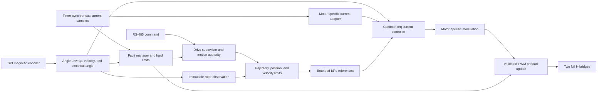

# Firmware Architecture

Status: firmware 0.38.0 is the current source and flashed baseline. The source
implements the reset-safe foundation, synchronous ADC
acquisition, OLED diagnostics, DMA RS-485 transport, native product diagnostics,
automatic/persistent alignment, an authoritative drive supervisor, and a 20 kHz
fixed-point A/B current loop. TIM6/TIM7, SPI1 DMA, and PendSV own the
deterministic encoder/rotor service at 8 MHz SPI and 4 kHz. Each
candidate acquisition is timestamped when CS asserts at the start of its
coherent four-byte window, rather than when post-hold publication completes. A
606 mA five-second baseline run completed with zero encoder, DMA, estimator,
backend, control, reset, or panic faults. Firmware 0.24.14 removes the completed local phase-selector and
direct fixed-duty PWM bring-up path while retaining the rotating-current
operation as a supervisor-authorized RS-485 production diagnostic. Firmware
0.24.15 makes
`rotor_control_runtime` the sole owner of raw encoder interpretation and angle
unwrapping; slower control receives only an immutable rotor observation.
Firmware 0.25.1 closes the first bounded velocity loop on that observation and
routes its mechanical effort through the persisted alignment direction into
the aligned-q-current actuator. Firmware 0.26.0 adds the focused relative-
position layer and is bench-proven for mirrored settling and generic STOP.
Firmware 0.26.1 adds an independent 3 ms foreground encoder-production guard.
Firmware 0.27.1 moves aligned-q electrical-phase advance into the authoritative
20 kHz backend with bounded fixed-point prediction and immediate stale-age
fault convergence.
Firmware 0.28.0 appends automatic-injected PA3 VBUS acquisition and protocol
1.10 status telemetry without moving the regular DMA/current-control event.
Firmware 0.29.0 adds foreground-owned operator fault acknowledgment and an
in-place `ZERO`/ADC/PWM/current-backend/runtime/supervisor recovery transaction.
Firmware 0.29.1 separates controller feedback timing from bounded predictor
dispatch age and publishes the evidence needed to inspect predictor rejection.
Firmware 0.29.2 reconciles the preempted-SysTick epoch gap through a bounded
monotonic microsecond publication while retaining the established priority
ordering.
Firmware 0.30.1 predicts aligned phase to the measured PWM application
boundary. Firmware 0.31.0 makes current-loop gains a safe-state product
configuration: trials are volatile, persistence remains a separate foreground
transaction, and active control still has one immutable configuration.
Firmware 0.32.2 reuses that validated immutable configuration in the 20 kHz
step instead of rescanning it, gates TIM2/DWT/preload instrumentation behind an
explicit trace arm, and replaces the 4 kHz full-controller publication with a
56-byte progress record plus 100 Hz/event-driven full state. Foreground safety
housekeeping consumes progress at 1 ms; raw Right-button sampling and RS-485
draining remain wake-driven.
Firmware 0.34.0 moves the diagnostic oscillator to the 20 kHz backend.
Firmware 0.35.0 adds a selectable fixed-point d/q PI only for that bounded
diagnostic, using sample-angle Park and 55 us application-angle inverse Park;
the stationary A/B PI remains the default and retains product-motion ownership.
Firmware 0.36.0 promotes the fixed-point d/q PI into the aligned-q actuator:
torque, velocity, and position command `d=0` plus signed q current through the
existing 20 kHz predictor/backend, while static references and alignment retain
stationary A/B PI. No outer controller or bridge-authority owner changes.
Firmware 0.37.1 removes telemetry-only A/B reconstruction from the ordinary
pre-PWM deadline and retains exact per-event reconstruction after staging only
when a trace is armed.
Firmware 0.38.0 adds a trace-gated, bufferless aggregate profiler across that
existing SPI/PendSV/rotor path and foreground housekeeping. It adds diagnostic
observation only; timer, estimator, controller, supervisor, bridge, fault, and
`ZERO` ownership remain unchanged.

## Design priorities

1. Deterministic bridge fault state and explicit accounting for the PCB's lack
   of a defined all-FET-off command.
2. Deterministic PWM and current-sampling timing.
3. Small, auditable hardware abstraction around the N32L406.
4. Testable control math and protocol parsing.
5. Useful motion features built on the proven current-control foundation.

## Product layering

| Layer | Responsibility |
| --- | --- |
| Startup/BSP | Clock, vector table, linker layout, watchdog, safe GPIO defaults |
| MCU drivers | Timers, ADC, DMA, SPI, USART, GPIO, flash, CRC |
| Board drivers | Bridge control, current sense, encoder, RS-485, display, buttons, isolated I/O |
| Control | Electrical angle, current loops, velocity estimation, velocity and position loops |
| Services | Configuration storage, calibration, fault manager, telemetry, protocol |
| Application | State machine and command arbitration |

## Implemented foundation

The current image implements:

- Nations CMSIS/device startup with a project-owned split-bank linker layout: 16 KiB SRAM1, an 8 KiB address gap, and 8 KiB SRAM2.
- A project-owned clock path that verifies reset-default 4 MHz MSI, then starts the fitted 8 MHz HSE and PLL x8 for a bench-proven 64 MHz HCLK with explicit APB and timer clock derivation.
- The initial stack and ordinary runtime sections confined to SRAM1; SRAM2 receives a store-only parity initialization and remains unavailable for allocation.
- Project-owned core-exception and unclaimed-interrupt panic handling with a `.noinit` panic code.
- Startup initialization and readback of the four-preemption-bit NVIC grouping, with SysTick fixed at priority 15.
- A 1 kHz SysTick timebase whose microsecond view uses bounded atomic
  reconciliation across nested interrupt priorities and normal uint32 wrap.
- A safe board layer that drives the PD0 status LED and verifies bridge pins before and after GPIOB activation.
- A bounded mode-3 SPI1 transport and host-tested MT6816 burst decoder on a
  4 kHz TIM6/TIM7/SPI-DMA schedule at an 8 MHz SPI target. The observation
  timestamp is captured at CS assertion, the start of the coherent four-byte
  acquisition window, before PendSV-deferred decode,
  feeding the shared angle unwrap and
  velocity estimator and reporting current/maximum observed sample intervals.
- A sequence-protected 56-byte rotor progress publication at 4 kHz containing
  encoder production, estimator health/timestamp, active-control flags, and
  full-snapshot generation. The 576-byte full controller snapshot publishes at
  100 Hz and on requests, faults, events, clears, and initialization.
- A bounded 333.3 kHz I2C1 transport and SSD1306-compatible 72-by-40 display;
  sustained 50 Hz two-page transactions are proven and the current-loop display uses 5 Hz.
- A bounded polling PA1/PA2/PA3 ADC bring-up path plus a TIM2-compare-triggered
  20 kHz `currentB`/`currentA` sequence captured by circular DMA channel 1, with
  a following automatic-injected PA3 VBUS conversion and host-tested schematic-
  derived engineering conversion using runtime reference and zeros.
- A 20 kHz fixed-point current step that retains raw-range, hard-current,
  reference, output-duty, PWM readback, and deadline checks while treating the
  active backend-owned configuration as already validated and immutable.
  TIM2/DWT/preload timing fields are captured only while the explicit one-shot
  current trace is armed.
- A receive-first USART1 transport with circular RX DMA, bounded foreground
  draining, DMA TX, and line-complete PC13 turnaround.
- A host-tested transport-independent command service and native v1 COBS/CRC
  adapter serving discovery, boot and encoder telemetry, and supervisor-gated
  current diagnostics, automatic alignment, bounded aligned q-current, and
  bounded signed velocity and relative position from foreground, including
  status and generic STOP while active.
- A project-owned persistent-configuration service using the final two 2 KiB
  Flash pages as alternating records. Schema, length, generation, CRC-32,
  semantic validation, and a commit-last marker protect boot loading; a newer
  incomplete or corrupt slot falls back to the previous record. Schema-1
  alignment records load with current firmware's default PI gains and migrate
  to schema 2 only through an explicit save or later configuration change.
- A versioned, sequence-protected debugger diagnostic record published by the foreground loop.
- A monotonic boot self-test ledger covering memory, clocks, priorities, passive GPIO construction, timebase, application state, and IWDG readiness.
- An edge-aligned 20 kHz TIM3 backend mapping channels 1-4 to
  PA6/PA7/PB0/PB1 on AF2, with four independent preloaded duties and a
  direct-GPIO all-low panic fallback.
- A fixed-point A/B PI current loop with conditional anti-windup,
  low-zero sign-magnitude H-bridge modulation, independent reference/raw-current/voltage/
  duty bounds, and DMA/PWM/deadline fault latching. Kp/Ki may be rebuilt only
  through an inactive, fault-free foreground transaction that first establishes
  `ZERO`; the 20 kHz ISR never observes a partial configuration.
- A fixed-point electrical-phase predictor owned by the current backend. Each
  accepted 4 kHz observation supplies measured phase, filtered mechanical
  velocity, direction, and acquisition-start timestamp; each 20 kHz current
  event extrapolates sample and PWM-application phases for rotating d/q control
  and faults through the common `ZERO` path if observation age exceeds 3 ms.
  Equivalent A/B reference telemetry is refreshed at 4 kHz or reconstructed
  after PWM staging for an explicitly armed per-event trace.
- An authoritative drive supervisor with native tests. It owns readiness,
  `RESET_SAFE`/`DIAGNOSTIC`/`READY`/`ALIGN`/`RUN`/`FAULT` transitions, separate
  diagnostic and motion authority, and bridge deauthorization on faults.
- A portable automatic-alignment controller that applies phase-zero,
  positive-quarter, and return-zero current vectors through the proven backend;
  validates current tracking, encoder stability, geometry, closure, and its
  deadline; and transactionally commits zero/direction only on full success.
- Automatic alignment persistence only after the backend is stopped and motion
  authority is released. Boot restores motor geometry/alignment but never
  authority, pending work, leases, faults, or startup current-sensor zeros;
  explicit safe-state save and persistent-clear operations use the same
  production configuration service. Automatic alignment save and calibration
  clear preserve the previously stored tuning (or defaults when no record
  exists); only explicit save promotes volatile-active gains.
- A portable fixed-point aligned-torque controller that slews signed q-current,
  validates calibrated electrical phase and publishes bounded predictor seeds,
  reports its
  complete policy/evidence, and independently faults invalid phase, feedback
  timing, velocity, acceleration, backend state, or reference acceptance before
  the existing current backend can retain authority.
- A product velocity controller that consumes only the runtime's immutable
  timestamped observation, acceleration-limits its reference, applies PI
  anti-windup at a per-command current ceiling, and dynamically commands the
  aligned-q-current actuator. Invalid/timed-out feedback, overspeed, numeric
  failure, or actuator failure enters the common fault/ZERO path.
- A focused relative-position controller that begins near rest, advances a
  bounded trapezoidal reference, retains independent travel, acceleration,
  following-error, settling, feedback-age, current, and deadline contracts,
  requires 200 settled samples at 4 kHz (about 50 ms), and drives only dynamic
  targets into the product velocity controller.
- An encoder-production liveness monitor independent of the callback-driven
  controller updates. If accepted sample evidence does not advance within 3
  ms, idle readiness is removed; any energized diagnostic or motion authority
  is forced through the shared fault/`ZERO` path.
- Portable angle unwrapping and plausibility checks, bounded trajectory
  generation, PI anti-windup, cascaded position/velocity control, Park and
  inverse-Park transforms, and vector-limited d/q current regulation with
  deterministic mechanical and electrical host-plant tests.
- Standalone cumulative-count step/direction decoding and the portable
  floating-point d/q controller remain host-tested and Arm-compiled for future
  integration. A distinct fixed-point d/q branch is linked only for the bounded
  rotating-current diagnostic; neither path owns product motion or authority.

The drive supervisor is the only application-level bridge authority. The
current-loop backend owns TIM3, DMA channel 1 completion, independent electrical
bounds, and the common all-low fault path. Its feedback signs, delayed sample observability,
active encoder polling, remote stop path, and bounded run behavior are proven
on the tested board. Calibration accuracy, analog bandwidth, switching-edge
margin, and protection latency remain characterization work as the operating
envelope expands.

The product-owned portable modules live under `firmware/src/control/`,
`firmware/src/app/`, and `firmware/src/services/` and are linked into `mks57d`.
The focused product velocity and relative-position controllers, their
trajectory/PI dependencies, and the encoder-liveness guard are linked. The
standalone step/direction decoder and d/q current controller form the
`mks57d_future_control` compile target and remain outside the product image;
both also retain host tests. The active diagnostic's fixed-point d/q branch is
implemented inside the board-specific phase-current loop and does not link this
portable future controller. Their contracts use revolutions, seconds,
amperes, volts, and radians explicitly.

`rotor_control_runtime` alone consumes raw encoder samples and owns the
angle-unwrapping/filter state. Its sequence-protected snapshot publishes a
`rotor_observation_t` containing validity, timestamp, unwrapped position, and
filtered velocity. The focused velocity and relative-position controllers
consume that immutable observation and independently enforce feedback age,
deadlines, speed, acceleration, current, and following-error limits. The
portable d/q current controller accepts stationary measured current plus d/q
references and emits a bounded stationary voltage vector, but that unqualified
future output is not connected to PWM. The bounded diagnostic may instead
select the backend's fixed-point d/q PI; product q-current is still transformed
into A/B current references and regulated by the proven stationary PI path.

`main.c` uses `product_command_context_t` as the foreground composition
aggregate for diagnostics, alignment, torque, configuration, and telemetry.
It contains pointers and bounded request mailboxes, but owns no estimator,
bridge state, or control loop. Velocity uses a dedicated
`velocity_command_context_t` and command-service domain; it shares only the
product readiness/exclusivity gates and hands a bounded request mailbox to the
rotor runtime. Relative position uses the same pattern through a dedicated
`position_command_context_t`. This keeps outer-loop state out of the legacy
aggregate without creating another bridge authority.

The clock, memory, watchdog, boot-self-test, encoder, and debug-observability
contracts are described in [Clock bring-up](CLOCKS.md), [Memory map](MEMORY.md),
[Independent watchdog policy](WATCHDOG.md), [Boot self-test](BOOT_SELF_TEST.md),
[MT6816 encoder bring-up](ENCODER.md), [USART1 / RS-485 bring-up](RS485.md), and
[Debugger diagnostic record](DIAGNOSTICS.md).
Interrupt priorities, execution ownership, control-loop boundaries, and the
PWM/ADC timing are defined in [Real-time and control
architecture](REALTIME_ARCHITECTURE.md). Remaining hardware characterization
is tracked separately from the behavior already demonstrated on the tested
board.

## Motor-personality boundary

Motor-specific control sits above the measured inverter/timing backend:

| Personality | Bridge use | Current observations |
| --- | --- | --- |
| Two-phase bipolar stepper | All four half-bridges as two H-bridges | Existing A/B current channels |
| Three-phase sensored PMSM/BLDC | Three half-bridges; fourth disconnected | Two sensed phase legs, third reconstructed |

The common backend would own TIM3 scheduling, ADC trigger placement, duty constraints, and immediate shutdown. A motor personality may request bounded voltage/current vectors but must not manipulate GPIO or timer registers directly.

The initial bring-up should be bare-metal. An RTOS can be reconsidered only if measured scheduling needs justify its flash, RAM, and fault-surface cost.

## Control data flow

## Real-time timing domains

- **PWM/current ISR:** initiated by a deterministic ADC completion event; reads one accepted current sample, applies current-loop limits, and prepares the next PWM preload values.
- **Encoder transport ISRs:** TIM6 releases the 4 kHz transaction and timestamps
  the observation when CS asserts at the start of the coherent four-byte
  acquisition window. TIM7 bounds CS setup/hold, SPI DMA completion publishes
  deferred work, and PendSV decodes and advances the rotor runtime; foreground
  consumes snapshots and mailboxes.
- **Position/velocity/motion loop:** runs below interrupt priority in the initial design and generates bounded `Id`/`Iq` demand.
- **Communications/background:** parses complete frames outside the current ISR,
  maintains diagnostics, applies or reverts volatile tuning only from a safe
  state, and commits configuration only through a separate explicit action.

The N32L406 has single-bank Flash behavior: erase/program stalls code fetches.
Configuration maintenance therefore runs only in foreground with interrupts
masked, the bridge forced to `ZERO`, no backend activity, and no supervisor
authority. The old slot remains valid throughout the new-slot transaction.

The active current loop runs at 20 kHz from DMA completion after a TIM2 compare
at 80% of the TIM3 carrier. Encoder acquisition is timer-released through SPI
DMA at 4 kHz (250 us nominal period), with decode and aligned-q-current updates
deferred through PendSV below the hard real-time current path. See [Real-time
and control architecture](REALTIME_ARCHITECTURE.md).

## Product application states

| State | Bridge | Purpose |
| --- | --- | --- |
| `RESET_SAFE` | Disabled | Establish clocks, safe GPIO, watchdog, and RAM invariants |
| `DIAGNOSTIC` | Disabled | Communications, measurements, board identification, readiness acquisition |
| `READY` | Disabled | Valid configuration and encoder present |
| `ALIGN` | Current-limited | Determine motor/encoder electrical alignment |
| `RUN` | Enabled | Execute bounded motion commands |
| `FAULT` | Disabled | Latch fault information and require explicit recovery |

No reset cause should transition directly to `ALIGN` or `RUN`.
`READY` requires initialized current feedback/control and a healthy accepted
encoder sample. Diagnostic current operation and future motion obtain distinct
authority through the supervisor. Readiness loss in `READY` returns to
`DIAGNOSTIC`; readiness loss in `ALIGN` or `RUN` removes authority and enters
`FAULT`. Expected fault reporting remains alive under the watchdog rather than
using reset as ordinary fault handling.

## Third-party reuse

Nations CMSIS and peripheral sources are appropriate for the MCU layer when
their license headers are preserved. Motor-control frameworks may contribute
algorithms and tests above the project-owned, bench-proven bridge and ADC/PWM
backend; raw bridge authority remains centralized in that backend.
