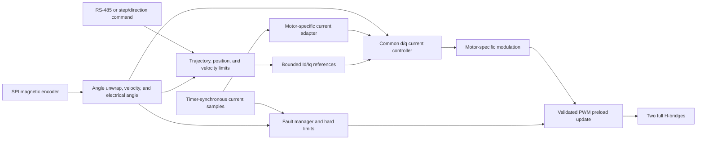

# Firmware Architecture

Status: the passive foundation is implemented; motor-control layers remain candidate architecture until the relevant hardware gates are passed.

## Design priorities

1. Safe and deterministic bridge shutdown.
2. Deterministic PWM and current-sampling timing.
3. Small, auditable hardware abstraction around the N32L406.
4. Testable control math and protocol parsing.
5. Feature compatibility only after the control foundation is stable.

## Candidate layering

| Layer | Responsibility |
| --- | --- |
| Startup/BSP | Clock, vector table, linker layout, watchdog, safe GPIO defaults |
| MCU drivers | Timers, ADC, DMA, SPI, USART, GPIO, flash, CRC |
| Board drivers | Bridge control, current sense, encoder, RS-485, display, buttons, isolated I/O |
| Control | Electrical angle, current loops, velocity estimation, velocity and position loops |
| Services | Configuration storage, calibration, fault manager, telemetry, protocol |
| Application | State machine and command arbitration |

## Implemented foundation

The initial image implements only the parts that can be meaningfully built before hardware arrives:

- Nations CMSIS/device startup with a project-owned split-bank linker layout: 16 KiB SRAM1, an 8 KiB address gap, and 8 KiB SRAM2.
- A project-owned minimal `SystemInit` that verifies and retains the reset-default 4 MHz MSI.
- The initial stack and ordinary runtime sections confined to SRAM1; SRAM2 receives a store-only parity initialization and remains unavailable for allocation.
- Project-owned core-exception and unclaimed-interrupt panic handling with a `.noinit` panic code.
- Startup initialization and readback of the four-preemption-bit NVIC grouping, with SysTick fixed at priority 15.
- A 1 kHz monotonic SysTick timebase.
- A passive board layer that configures only the provisional PB9 LED.
- A versioned, sequence-protected debugger diagnostic record published by the foreground loop.
- Hardware-independent application-state and fault-latch modules with native tests.

There is deliberately no bridge module yet. Creating one would imply shutdown behavior, polarity, and pin truth that have not been verified on a purchased board.

The clock, memory, watchdog, and debug-observability contracts are described in [Clock bring-up](CLOCKS.md), [Memory map](MEMORY.md), [Independent watchdog policy](WATCHDOG.md), and [Debugger diagnostic record](DIAGNOSTICS.md). Interrupt priorities, execution ownership, control-loop boundaries, and the unresolved PWM/ADC trigger options are defined in [Real-time and control architecture](REALTIME_ARCHITECTURE.md). Hardware-dependent portions remain bench-validation items rather than proven behavior.

## Candidate motor-personality boundary

If power-stage characterization succeeds, motor-specific control should sit above one measured inverter/timing backend:

| Personality | Bridge use | Current observations |
| --- | --- | --- |
| Two-phase bipolar stepper | All four half-bridges as two H-bridges | Existing A/B current channels |
| Three-phase sensored PMSM/BLDC | Three half-bridges; fourth disconnected | Two sensed phase legs, third reconstructed |

The common backend would own TIM3 scheduling, ADC trigger placement, duty constraints, and immediate shutdown. A motor personality may request bounded voltage/current vectors but must not manipulate GPIO or timer registers directly.

The initial bring-up should be bare-metal. An RTOS can be reconsidered only if measured scheduling needs justify its flash, RAM, and fault-surface cost.

## Control data flow

## Real-time timing domains

- **PWM/current ISR:** initiated by a deterministic ADC completion event; reads one accepted current sample, applies current-loop limits, and prepares the next PWM preload values.
- **Encoder acquisition ISR:** publishes a timestamped angle snapshot but does not run the outer control loops.
- **Position/velocity/motion loop:** runs below interrupt priority in the initial design and generates bounded `Id`/`Iq` demand.
- **Communications/background:** parses complete frames outside the current ISR, maintains diagnostics, and commits configuration only from safe states.

Exact rates and PWM/ADC triggering must be selected from measurements rather than copied from another controller. The Nations example demonstrates 20 kHz center-aligned PWM, but TIM3 update behavior and the use of all four compare channels make the board's sampling topology a separate validation problem. See [Real-time and control architecture](REALTIME_ARCHITECTURE.md).

## Candidate application states

| State | Bridge | Purpose |
| --- | --- | --- |
| `RESET_SAFE` | Disabled | Establish clocks, safe GPIO, watchdog, and RAM invariants |
| `DIAGNOSTIC` | Disabled | Communications, measurements, board identification |
| `READY` | Disabled | Valid configuration and encoder present |
| `ALIGN` | Current-limited | Determine motor/encoder electrical alignment |
| `RUN` | Enabled | Execute bounded motion commands |
| `FAULT` | Disabled | Latch fault information and require explicit recovery |

No reset cause should transition directly to `ALIGN` or `RUN`.

## Third-party reuse

Nations CMSIS and peripheral sources are appropriate for the MCU layer when their license headers are preserved. Motor-control frameworks may contribute algorithms or tests, but their hardware abstractions must not control bridge safety or ADC/PWM timing until those paths are validated natively.
