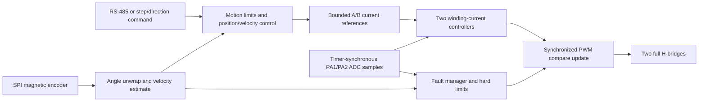

# Proposed Firmware Architecture

Status: candidate architecture for feasibility planning. It becomes binding only as individual decisions are validated and logged.

## Design priorities

1. Safe and deterministic bridge shutdown.
2. Deterministic PWM and current-sampling timing.
3. Small, auditable hardware abstraction around the N32L406.
4. Testable control math and protocol parsing.
5. Feature compatibility only after the control foundation is stable.

## Candidate layering

| Layer | Responsibility |
| --- | --- |
| Startup/BSP | Clock, vector table, linker layout, watchdog, safe GPIO defaults |
| MCU drivers | Timers, ADC, DMA, SPI, USART, GPIO, flash, CRC |
| Board drivers | Bridge control, current sense, encoder, RS-485, display, buttons, isolated I/O |
| Control | Electrical angle, current loops, velocity estimation, velocity and position loops |
| Services | Configuration storage, calibration, fault manager, telemetry, protocol |
| Application | State machine and command arbitration |

The initial bring-up should be bare-metal. An RTOS can be reconsidered only if measured scheduling needs justify its flash, RAM, and fault-surface cost.

## Control data flow

## Candidate timing domains

- **PWM/current ISR:** initiated by a deterministic timer/ADC event; reads current samples, applies current-loop limits, and prepares the next PWM compare values.
- **Encoder/velocity loop:** lower rate than the current loop; unwraps position and estimates velocity.
- **Position/motion loop:** generates bounded current or torque demand.
- **Communications/background:** parses complete frames outside the current ISR, maintains diagnostics, and commits configuration only from safe states.

Exact rates must be selected from measurements rather than copied from another controller. The Nations example demonstrates 20 kHz center-aligned PWM but does not establish that 20 kHz is optimal for this board.

## Candidate application states

| State | Bridge | Purpose |
| --- | --- | --- |
| `RESET_SAFE` | Disabled | Establish clocks, safe GPIO, watchdog, and RAM invariants |
| `DIAGNOSTIC` | Disabled | Communications, measurements, board identification |
| `READY` | Disabled | Valid configuration and encoder present |
| `ALIGN` | Current-limited | Determine motor/encoder electrical alignment |
| `RUN` | Enabled | Execute bounded motion commands |
| `FAULT` | Disabled | Latch fault information and require explicit recovery |

No reset cause should transition directly to `ALIGN` or `RUN`.

## Third-party reuse

Nations CMSIS and peripheral sources are appropriate for the MCU layer when their license headers are preserved. Motor-control frameworks may contribute algorithms or tests, but their hardware abstractions must not control bridge safety or ADC/PWM timing until those paths are validated natively.

