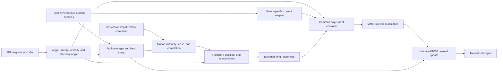

# Firmware Architecture

Status: firmware 0.18.2 implements the reset-safe foundation, continuous
encoder and synchronous ADC acquisition, OLED diagnostics, DMA RS-485
transport, native commissioning protocol, and a 20 kHz fixed-point A/B current
loop. Low-zero sign-magnitude modulation, 80%-carrier sampling, raw overcurrent
trips, and the carrier deadline guardian are bench-proven with an attached
motor. An encoder-observed 757 mA, 20 Hz electrical run produced smooth motion
at 23.7 RPM for five seconds without a current-loop, encoder, SPI, or reset fault.

## Design priorities

1. Deterministic bridge fault state and explicit accounting for the PCB's lack
   of a defined all-FET-off command.
2. Deterministic PWM and current-sampling timing.
3. Small, auditable hardware abstraction around the N32L406.
4. Testable control math and protocol parsing.
5. Useful motion features built on the proven current-control foundation.

## Candidate layering

| Layer | Responsibility |
| --- | --- |
| Startup/BSP | Clock, vector table, linker layout, watchdog, safe GPIO defaults |
| MCU drivers | Timers, ADC, DMA, SPI, USART, GPIO, flash, CRC |
| Board drivers | Bridge control, current sense, encoder, RS-485, display, buttons, isolated I/O |
| Control | Electrical angle, current loops, velocity estimation, velocity and position loops |
| Services | Configuration storage, calibration, fault manager, telemetry, protocol |
| Application | State machine and command arbitration |

## Implemented foundation

The current image implements:

- Nations CMSIS/device startup with a project-owned split-bank linker layout: 16 KiB SRAM1, an 8 KiB address gap, and 8 KiB SRAM2.
- A project-owned clock path that verifies reset-default 4 MHz MSI, then starts the fitted 8 MHz HSE and PLL x8 for a bench-proven 64 MHz HCLK with explicit APB and timer clock derivation.
- The initial stack and ordinary runtime sections confined to SRAM1; SRAM2 receives a store-only parity initialization and remains unavailable for allocation.
- Project-owned core-exception and unclaimed-interrupt panic handling with a `.noinit` panic code.
- Startup initialization and readback of the four-preemption-bit NVIC grouping, with SysTick fixed at priority 15.
- A 1 kHz monotonic SysTick timebase.
- A safe board layer that drives the PD0 status LED and verifies bridge pins before and after GPIOB activation.
- A bounded mode-3 SPI1 transport and host-tested MT6816 burst decoder, sampled at 100 Hz by foreground.
- A bounded 333.3 kHz I2C1 transport and SSD1306-compatible 72-by-40 display;
  sustained 50 Hz two-page transactions are proven and the current-loop display uses 5 Hz.
- A bounded polling PA1/PA2/PA3 ADC bring-up path plus a TIM2-compare-triggered
  20 kHz `currentB`/`currentA` sequence captured by circular DMA channel 1, with
  host-tested schematic-derived engineering conversion using runtime reference
  and zeros.
- A receive-first USART1 transport with circular RX DMA, bounded foreground
  draining, DMA TX, and line-complete PC13 turnaround.
- A host-tested transport-independent command service and native v1 COBS/CRC
  adapter serving discovery, boot and encoder telemetry, and current-loop
  status/configure/start/stop from foreground, including status and STOP while
  active.
- A versioned, sequence-protected debugger diagnostic record published by the foreground loop.
- A monotonic boot self-test ledger covering memory, clocks, priorities, passive GPIO construction, timebase, application state, and IWDG readiness.
- An edge-aligned 20 kHz TIM3 backend mapping channels 1-4 to
  PA6/PA7/PB0/PB1 on AF2, with four independent preloaded duties and a
  direct-GPIO all-low panic fallback.
- A fixed-point A/B PI current loop with conditional anti-windup,
  low-zero sign-magnitude H-bridge modulation, independent reference/raw-current/voltage/
  duty bounds, and DMA/PWM/deadline fault latching.
- Hardware-independent application-state and fault-latch modules with native tests.
- Portable angle unwrapping and plausibility checks, bounded trajectory
  generation, PI anti-windup, cascaded position/velocity control, Park and
  inverse-Park transforms, and vector-limited d/q current regulation with
  deterministic mechanical and electrical host-plant tests.
- A portable application shell that arbitrates native, Modbus, Makerbase,
  step/direction, and local motion sources; applies explicit enable, stop,
  disable, lease, completion, and recovery contracts; and drives the servo core
  in end-to-end simulated-plant tests.

The current-loop bridge module owns TIM3, DMA channel 1 completion, and the
common all-low fault path. Its feedback signs, delayed sample observability,
active encoder polling, remote stop path, and bounded run behavior are proven
on the tested board. Calibration accuracy, analog bandwidth, switching-edge
margin, and protection latency remain characterization work as the operating
envelope expands.

The portable control and application modules live under
`firmware/src/control/` and `firmware/src/app/`. They are compiled for both the
host and the exact Arm target. The fixed-point phase loop and rotating
current reference are linked into `mks57d`; the outer application,
estimator, trajectory, and d/q servo path remain excluded. Their contracts use
revolutions, seconds, amperes, volts, and radians explicitly. The outer servo
core accepts timestamped raw
encoder samples and emits a hard-clamped torque-current request; stale input,
missed control deadlines, excessive following error, implausible encoder
motion, and invalid arithmetic latch the output invalid. The current-control
core accepts stationary measured current plus d/q references and emits a
bounded stationary voltage vector. The proven two-phase backend will adapt
these contracts to the board as the outer loops are integrated.

The clock, memory, watchdog, boot-self-test, encoder, and debug-observability
contracts are described in [Clock bring-up](CLOCKS.md), [Memory map](MEMORY.md),
[Independent watchdog policy](WATCHDOG.md), [Boot self-test](BOOT_SELF_TEST.md),
[MT6816 encoder bring-up](ENCODER.md), [USART1 / RS-485 bring-up](RS485.md), and
[Debugger diagnostic record](DIAGNOSTICS.md).
Interrupt priorities, execution ownership, control-loop boundaries, and the
PWM/ADC timing are defined in [Real-time and control
architecture](REALTIME_ARCHITECTURE.md). Remaining hardware characterization
is tracked separately from the behavior already demonstrated on the tested
board.

## Motor-personality boundary

Motor-specific control sits above the measured inverter/timing backend:

| Personality | Bridge use | Current observations |
| --- | --- | --- |
| Two-phase bipolar stepper | All four half-bridges as two H-bridges | Existing A/B current channels |
| Three-phase sensored PMSM/BLDC | Three half-bridges; fourth disconnected | Two sensed phase legs, third reconstructed |

The common backend would own TIM3 scheduling, ADC trigger placement, duty constraints, and immediate shutdown. A motor personality may request bounded voltage/current vectors but must not manipulate GPIO or timer registers directly.

The initial bring-up should be bare-metal. An RTOS can be reconsidered only if measured scheduling needs justify its flash, RAM, and fault-surface cost.

## Control data flow

## Real-time timing domains

- **PWM/current ISR:** initiated by a deterministic ADC completion event; reads one accepted current sample, applies current-loop limits, and prepares the next PWM preload values.
- **Encoder acquisition ISR (future):** publishes a timestamped angle snapshot but does not run the outer control loops. The present 100 Hz bring-up reader runs cooperatively in foreground.
- **Position/velocity/motion loop:** runs below interrupt priority in the initial design and generates bounded `Id`/`Iq` demand.
- **Communications/background:** parses complete frames outside the current ISR, maintains diagnostics, and commits configuration only from safe states.

The active current loop runs at 20 kHz from DMA completion after a TIM2 compare
at 30% of the TIM3 carrier. Encoder acquisition currently runs at 100 Hz in
foreground. Outer-loop and higher-rate encoder scheduling will be selected
from measured execution time and signal quality. See [Real-time and control
architecture](REALTIME_ARCHITECTURE.md).

## Candidate application states

| State | Bridge | Purpose |
| --- | --- | --- |
| `RESET_SAFE` | Disabled | Establish clocks, safe GPIO, watchdog, and RAM invariants |
| `DIAGNOSTIC` | Disabled | Communications, measurements, board identification |
| `READY` | Disabled | Valid configuration and encoder present |
| `ALIGN` | Current-limited | Determine motor/encoder electrical alignment |
| `RUN` | Enabled | Execute bounded motion commands |
| `FAULT` | Disabled | Latch fault information and require explicit recovery |

No reset cause should transition directly to `ALIGN` or `RUN`.

## Third-party reuse

Nations CMSIS and peripheral sources are appropriate for the MCU layer when
their license headers are preserved. Motor-control frameworks may contribute
algorithms and tests above the project-owned, bench-proven bridge and ADC/PWM
backend; raw bridge authority remains centralized in that backend.
