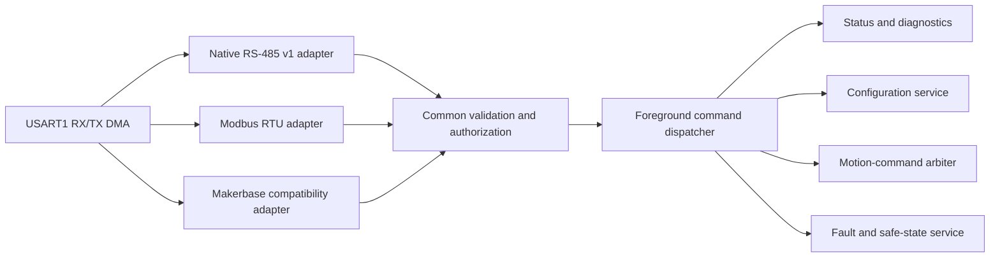

# Command Protocol Architecture

Status: native protocol 1.19 is unchanged in the firmware 0.38.6 source
candidate and implemented in the currently flashed firmware 0.38.4.
Protocol 1.12 trace schema 1
remains backward-decodable by the host.
Discovery, boot and encoder telemetry, the
current diagnostic service, generic drive STOP, automatic alignment, and
power-loss-safe motor-configuration storage, bounded aligned q-current, and the
first bounded velocity service, relative-position control, and explicit fault
acknowledgment/recovery are implemented and host-tested.
Firmware 0.18.2
configured, started, observed, traced, and stopped encoder-verified motor runs
on the bench. Firmware 0.19.0 routes the retained diagnostic requests through
the product drive supervisor and has passed both deadline-release and explicit-
STOP motor regressions. Address
provisioning, native-wire duplicate handling, absolute-position/homing commands, Modbus
RTU, and Makerbase compatibility remain future work.

## Decision

The firmware will expose one transport-independent command service. Native
RS-485, Modbus RTU, and Makerbase-compatible wire decoders are adapters around
that service; none owns motor behavior or bypasses common validation.



The internal command model uses named operations and typed values. Makerbase
function numbers, Modbus register addresses, and native message identifiers
exist only in adapter mapping tables. This keeps command behavior consistent
and host-testable across every interface.

## Protocol roles

### Native RS-485 v1

The native protocol is the canonical interface for new host software and
future features. Version 1 uses a bounded, delimiter-based binary frame:

```text
COBS {
    version:u8 | device_address:u8 | sequence:u16 |
    message_type:u8 | command:u16 | payload_length:u8 |
    payload:0..80 bytes | crc16:u16
} 00
```

All multi-byte values are big-endian. CRC-16/CCITT-FALSE covers the decoded
frame from `version` through the final payload byte: polynomial `0x1021`,
initial value `0xFFFF`, no reflection, and no final XOR. The two-byte CRC is
stored high byte first. The COBS-encoded frame ends with one `0x00` delimiter.
The frame `version` is the protocol major version and is currently `1`;
compatible minor revisions are reported by `GET_IDENTITY`.

The `COMMISSIONING` and `CURRENT_TEST` names in protocol 1.3 are retained wire
compatibility labels. They denote bounded product diagnostics, not a separate
firmware personality or a bridge-authority owner. New protocol work should use
product motion, service, and diagnostic names while preserving these encodings
for compatible clients.

The decoded header is 8 bytes, the maximum decoded frame is 90 bytes, and the
maximum on-wire frame including the delimiter is 92 bytes. Frames with an
invalid COBS encoding, inconsistent length, bad CRC, unsupported version, or
excessive encoded length receive no response. After an oversized frame the
parser discards through the next delimiter and starts cleanly.

The `device_address` range is 1-247; firmware currently uses address 1.
Address 0 is broadcast. The initial read-only commands are not broadcast-safe,
so a valid broadcast is counted and dropped without dispatch or response.
Frames for another address and non-request message types are likewise ignored.

Message types are `1` request, `2` response, and `3` event. Requests carry a
16-bit sequence chosen by the host; a response echoes it. Version 1 does not
yet cache or reject duplicate sequences, so the host must wait for a response
or timeout before sending another request to a device.

Every response payload begins with one status byte:

| Value | Status |
| ---: | --- |
| 0 | Success |
| 1 | Unknown command |
| 2 | Invalid payload |
| 3 | Service unavailable |
| 4 | Internal error |

Only complete, version-1, CRC-valid requests for this address receive command
errors. This prevents noise, foreign traffic, broadcasts, responses, or events
from causing reply storms.

### Implemented native commands

| Command | Name | Request payload | Successful response after status |
| ---: | --- | --- | --- |
| `0x0001` | `PING` | 0-16 opaque bytes | The same bytes |
| `0x0002` | `GET_IDENTITY` | Empty | Product ID `u32`, firmware major `u8`, minor `u8`, patch `u16`, protocol major `u8`, minor `u8` |
| `0x0003` | `GET_CAPABILITIES` | Empty | Capability bitmap `u32` |
| `0x0100` | `GET_COMMISSIONING_STATUS` | Empty | Schema-5 commissioning status block |
| `0x0101` | `CONFIGURE_CURRENT_TEST` | Legacy: amplitude counts `u16`, frequency millihertz `u32`; protocol 1.17 extended: those fields plus controller mode `u8` | Applied request fields; the mode byte is returned for the extended request |
| `0x0102` | `START_CURRENT_TEST` | Legacy: initial leg `u8`, hold milliseconds `u32`; protocol 1.15 extended: initial leg `u8`, ramp milliseconds `u32`, hold milliseconds `u32` | Empty |
| `0x0103` | `STOP_CURRENT_TEST` | Empty | Empty |
| `0x0104` | `GET_BOOT_STATUS` | Empty | Schema `u8`, RCC reset flags `u32`, retained panic `u8`, uptime milliseconds `u32` |
| `0x0105` | `GET_ENCODER_STATUS` | Empty | Schema-2 raw encoder, mechanical estimator, alignment, electrical-phase, and scheduling block described below |
| `0x0106` | `GET_CURRENT_TRACE` | Sample index `u16` | Schema-2 current, prediction, carrier-timer, DWT, and PWM-preload sample described below |
| `0x0107` | `ARM_CURRENT_TRACE` | Empty | Empty |
| `0x0108` | `GET_RUNTIME_PROFILE` | Empty | Completed schema-1 aggregate runtime profile described below |
| `0x0109` | `ARM_RUNTIME_PROFILE` | Empty | Empty |
| `0x0200` | `START_ALIGNMENT` | Requested current counts `u16` | Empty |
| `0x0201` | `GET_ALIGNMENT_STATUS` | Empty | Schema-1 automatic-alignment status block described below |
| `0x0202` | `STOP_DRIVE` | Empty | Empty |
| `0x0203` | `CLEAR_FAULTS` | Empty | Schema-1 fault-recovery status block described below |
| `0x0300` | `GET_CONFIGURATION_STATUS` | Empty | Schema-1 or schema-2 persistent/active configuration status block described below |
| `0x0301` | `SAVE_CONFIGURATION` | Empty | Empty |
| `0x0302` | `CLEAR_CALIBRATION` | Empty | Empty |
| `0x0303` | `SET_CURRENT_LOOP_GAINS` | Proportional gain Q16.16 `i32`, integral gain Q16.16 per 20 kHz step `i32` | Empty |
| `0x0304` | `REVERT_CURRENT_LOOP_GAINS` | Empty | Empty |
| `0x0400` | `START_ALIGNED_TORQUE` | Signed q-current counts `i16`, duration milliseconds `u32` | Empty |
| `0x0401` | `GET_ALIGNED_TORQUE_STATUS` | Empty | Schema-2 aligned-torque state, prediction rejection evidence, and complete policy block described below |
| `0x0500` | `START_VELOCITY` | Legacy: signed target mechanical velocity Q16.16 rev/s `i32`, positive q-current limit counts `u16`, duration milliseconds `u32`; protocol 1.18 extended: those fields plus positive reference acceleration Q16.16 rev/s² `i32` | Empty |
| `0x0501` | `GET_VELOCITY_STATUS` | Empty | Schema-1 velocity state, evidence, and policy block described below |
| `0x0600` | `START_POSITION_RELATIVE` | Signed relative displacement Q16.16 revolutions `i32`, positive maximum velocity Q16.16 rev/s `i32`, positive maximum acceleration Q16.16 rev/s² `i32`, positive q-current limit counts `u16`, duration milliseconds `u32` | Empty |
| `0x0601` | `GET_POSITION_STATUS` | Empty | Schema-1 position state, evidence, and policy block described below |

The product ID is `0x4D4B5335` (`MKS5`). Firmware 0.19.0 / protocol 1.3 is the
bench-proven converged supervisor image. Firmware 0.20.0 / protocol 1.4 appends
mechanical-estimator, alignment, electrical-phase, and sample-interval telemetry
to `GET_ENCODER_STATUS`; the current host tool decodes both schema 1 and schema
2, while fixed-length third-party clients must check identity/schema before
decoding. Firmware 0.21.0 / protocol 1.5 adds the bounded automatic-alignment
service and a generic STOP operation; successful, repeatable alignment and STOP
are bench-proven on the tested motor. Firmware 0.22.0 / protocol 1.6 adds the
versioned dual-slot configuration record and its production service commands;
its host, target, reset, power-cycle, persistent-clear, and wear-avoidance gates
pass. Firmware 0.23.2 / protocol 1.7 provides the first production motion
interface: signed encoder-aligned q-current through the proven A/B current
backend with independent current, slew, velocity, acceleration, feedback-age,
and duration contracts. Firmware 0.25.1 / protocol 1.8 provides signed bounded
velocity with an acceleration-limited reference, PI-generated q-current,
per-command current limit, finite deadline, status, and generic STOP through
that same actuator. Positive velocity uses the same mechanical coordinate as
encoder telemetry; the persisted alignment direction maps controller effort to
q-current without changing the protocol. Firmware 0.26.0 / protocol 1.9 adds
bounded relative-position trajectories above that same velocity/current
actuator. Mirrored
relative-position settling and generic STOP are bench-proven. Firmware 0.26.1
retains protocol 1.9 and its payload layouts while adding the independent
encoder-production liveness prerequisite. Firmware 0.27.1 also retains protocol
1.9, moves electrical-phase advance/A-B mapping into the 20 kHz backend, opens
velocity/position evaluation permission, and gives the cascade correction
headroom; no command or payload layout changes. Protocol 1.3 added the bounded current trace validated
through complete 256-sample, fault-free 20 kHz captures and the Kp=2 tuning sweep. The
capability bitmap uses the same stable bit definitions as the debugger
diagnostic record, including the native-protocol capability.

Firmware 0.28.0 / protocol 1.10 appends the latest automatic-injected PA3 VBUS
sample and its accepted foreground sample count to commissioning status schema
3. Existing status offsets are unchanged. Wire-level current counts,
phase-command permille, and duty permille remain available as exact controller
diagnostics; the host treats milliamperes/amperes, measured bus volts, and
bus-scaled commanded average phase volts as the primary engineering units.

Firmware 0.29.0 / protocol 1.11 adds `CLEAR_FAULTS` without changing any
existing command or response layout. The host console exposes it directly as
`clear-faults`.

Firmware 0.29.1 / protocol 1.12 appends phase-prediction rejection reason,
rejected age, maximum successful age, and configured maximum age to aligned-
torque status schema 2. Every schema-1 field and offset is unchanged, and the
host decodes both schemas.

Firmware 0.30.0 / protocol 1.13 adds `ARM_CURRENT_TRACE` and current-trace
schema 2. It appends the predicted electrical phase, prediction age, TIM2
trigger phase and trigger-to-DMA timing, DWT DMA-entry-to-PWM/trace timing, and
TIM3 preload margin without moving schema-1 fields.

Firmware 0.33.0 / protocol 1.15 adds the nine-byte
`START_CURRENT_TEST` request without removing the original five-byte request.
The extended request ramps diagnostic electrical frequency from zero to the
configured target, then retains that target for the complete hold interval.
No command ID, response, status schema, or capability bit changes.

Firmware 0.34.0 / protocol 1.16 moves the rotating diagnostic oscillator from
the 1 kHz foreground into the 20 kHz ADC/current-loop event. It also appends
the per-run count of PWM update boundaries that observed no new staged output
and the maximum consecutive count to commissioning status schema 4. Status
schemas 2 and 3 remain host-decodable.

Firmware 0.35.0 / protocol 1.17 adds a backward-compatible seven-byte
`CONFIGURE_CURRENT_TEST` request and status schema 5. Controller mode `0`
selects the established stationary A/B PI and mode `1` selects the fixed-point
rotating-frame PI. The legacy six-byte request selects mode 0 and receives the
legacy six-byte response body. An extended request receives the applied mode as
a seventh response byte. Schema 5 appends the configured diagnostic-controller
mode without moving any older status field.

Firmware 0.37.0 / protocol 1.18 adds a backward-compatible 14-byte
`START_VELOCITY` request by appending positive Q16.16 reference acceleration to
the legacy 10-byte request. The legacy form selects 16 rev/s². No command ID,
response, status schema, authority rule, or independent safety bound changes.

Firmware 0.38.0 / protocol 1.19 adds the read-only aggregate runtime profiler.
`ARM_RUNTIME_PROFILE` explicitly starts one 256-release window and is
unavailable while a window is already armed. `GET_RUNTIME_PROFILE` is
unavailable until that window completes, then returns the stable 78-byte body
below after the normal response-status byte:

```text
schema:u8 | state:u8 | captured_release_count:u16 |
incomplete_release_count:u16 | foreground_sample_count:u16 |
current_loop_completion_count:u32 |
maximum_current_loop_completions_per_release:u16 |
8 * { total_cycles:u32 | maximum_cycles:u32 }
```

Schema 1 uses state `0=idle`, `1=armed`, and `2=complete`. Metric order is
pend-to-PendSV-entry latency, PendSV dispatch/copy, encoder decode, estimator,
active control/request work, publication, total PendSV work, and foreground
housekeeping. All cycle fields use the 64 MHz DWT counter. The first seven
metrics share `captured_release_count - incomplete_release_count` valid
samples; foreground uses its separate count. The current-loop count is the
number of higher-priority current-loop completions observed during profiled
PendSV executions. Arming this aggregate profile does not allocate a sample
buffer and may be combined with `ARM_CURRENT_TRACE`; enabling either profiler
does not reset an already-running DWT counter.

The current-loop commands are the present low-level motor-diagnostic service;
they are not a velocity or position protocol. `CONFIGURE_CURRENT_TEST` is accepted only while
inactive. Amplitude is currently bounded to 1-495 ADC counts and frequency to
1-1000000 millihertz. The optional controller mode changes only this diagnostic;
aligned torque, velocity, and position retain the stationary A/B current loop.
`START_CURRENT_TEST` accepts leg values `0=A1`, `1=A2`,
`2=B1`, and `3=B2`. The five-byte form supplies a 3-through-2147483647 ms
hold and starts at the configured frequency immediately. The nine-byte form
supplies a nonnegative ramp duration followed by a hold in that same range;
ramp plus hold must not exceed 2147483647 ms. Firmware 0.34.0 advances the
diagnostic reference at the 20 kHz current-loop rate and linearly increases
phase increment during the ramp,
reaching the configured frequency at its end. Current amplitude is applied at
the initial electrical phase when authority starts. It is unavailable
until the product supervisor reaches `READY` from calibrated current feedback,
initialized current control, and a healthy encoder sample, or while authority
is already active, a fault is latched, or the physical Right button is asserted. START requests
diagnostic authority from the supervisor before the backend can switch.
`STOP_CURRENT_TEST` remains a wire-compatible alias for generic stop behavior.
`STOP_DRIVE` is the preferred name and is always accepted; either operation
stops a current diagnostic, alignment, aligned-torque, velocity, or position operation before
releasing its authority. A remote run also stops at its single ramp-plus-hold
deadline, on the physical Right button, or on an
RS-485 transport failure. Foreground parsing continues during a run so status
and STOP remain usable.

`CLEAR_FAULTS` is distinct from STOP. STOP requests termination of active
authority and does not acknowledge or erase a fault. `CLEAR_FAULTS` is the
operator acknowledgment that the condition which caused the fault is gone.
Firmware does not require a healthy encoder sample, an in-range current sample,
released Right button, or any other second proof of that assertion before it
attempts recovery.

When a fault is present, recovery first cancels all command mailboxes and
establishes the direct-GPIO all-low `ZERO` vector. It then rebuilds the
timer-synchronous ADC/DMA acquisition, TIM3 PWM/current backend, estimator when
faulted, alignment-operation state, aligned-torque state, velocity state, and
position state; clears pending runtime fault events; and acknowledges the
supervisor into uncommanded `DIAGNOSTIC`. Accepted motor alignment, persistent
configuration, reset cause, watchdog history, and retained panic evidence are
not erased. Fresh current and encoder production subsequently move the normal
readiness logic from `DIAGNOSTIC` to `READY`. If the asserted condition is still
present, its ordinary monitor faults again when it is observed or when a new
operation exercises it.

The command is idempotent: with no recognized fault it returns `no_fault` and
does not disturb a healthy operation. `blocked` means the attempted ZERO/backend,
runtime, or supervisor reset did not complete coherently; it does not classify
the initiating fault source as permanently unrecoverable. The 14-byte schema-1
body is:

| Offset | Type | Meaning |
| ---: | --- | --- |
| 0 | `u8` | Schema, currently 1 |
| 1 | `u8` | Result: 0 cleared, 1 no fault, 2 blocked |
| 2 | `u32` | Blocker flags |
| 6 | `u32` | Cleared fault-source flags |
| 10 | `u32` | Remaining fault-source flags |

Blocker bits are 0 ZERO establishment failed, 1 ADC/PWM/current-backend reset
failed, 2 rotor-runtime reset failed, and 3 supervisor reset failed. Fault-source
bits are 0 supervisor, 1 estimator, 2 alignment, 3 aligned torque, 4 velocity,
5 position, and 6 current backend. A position following-error event commonly
reports position plus the cascaded velocity/actuator and supervisor sources;
one successful command clears the complete set.

`START_ALIGNMENT` is accepted only from supervisor `READY`, with current and
encoder readiness intact, Right button released, no fault, no active/pending current
diagnostic, and no existing alignment operation. The requested current is
currently bounded to 50-495 ADC counts. The controller applies `(A=+I,B=0)`,
then `(A=0,B=+I)`, then `(A=+I,B=0)` through the production current backend
under `ALIGN` motion authority. It samples only settled encoder/current data,
checks the observed quarter-step geometry and final closure, and transactionally
commits zero and direction only after the whole sequence passes. Failed or
aborted attempts preserve an earlier valid calibration.

After a successful alignment, firmware first stops the current backend and
releases motion authority, then automatically persists the accepted motor
geometry, electrical zero, observed quarter step, error, and direction. An
unchanged calibration causes no Flash erase or program operation. A storage
failure does not invalidate the accepted RAM calibration for the current boot;
configuration status reports the failure and that the active calibration does
not match the stored record.

The initial 50-count minimum is an alignment policy candidate based on the
repeatable 303 mA cardinal test; 165 counts is the existing current-backend
request ceiling, not a hardware capability claim. The initial observation
policy is 750 ms settle per state, 100 ms sample windows with at least 64
samples, a 4 s total deadline, at most 8 raw counts of within-window span, 12
counts of return-closure error, and 8 counts of current-tracking error. These
values are explicitly subject to bench tuning and the project-wide limit
inventory; they are not motor speed, current, or physical travel limits.

`START_ALIGNED_TORQUE` is accepted only from supervisor `READY` with a valid
persisted or newly accepted alignment, healthy timestamped encoder feedback,
initialized current control, Right button released, no fault, and no other active or
pending drive operation. It enters `RUN` with motion authority and starts the
20 kHz backend at zero reference. Every accepted 4 kHz encoder sample validates
and slews signed q-current, then publishes measured electrical phase, filtered
mechanical velocity, direction, and the CS-assertion timestamp marking the start
of the coherent four-byte acquisition window to the backend. Every 20 kHz
current event extrapolates sample/application phase and runs the bounded d/q PI
plus bridge shutdown path. Equivalent A/B reference telemetry is refreshed at
the accepted 4 kHz observation boundary, or reconstructed per event after PWM
staging when a high-resolution trace is armed. The outer
controllers still accept at most 2,000 us between feedback timestamps. The 20 kHz predictor
allows age through 3,000 us, leaving four nominal 250 us accepted-sample
releases of predictor dispatch headroom beyond the controllers' 2,000 us
limit, but never outliving the independent 3,000 us encoder-production guard.
Invalid or older prediction faults to `ZERO`.
Positive q-current maps to `A=-Iq*sin(theta), B=Iq*cos(theta)` under the
accepted motor convention.

The 0.23.2 evaluation policy is ±495 counts (±2.999 A nominal on the tested
current front end), 10,000 counts/s current slew (about 60.59 A/s), 5 mechanical
rev/s (300 RPM), 1,000 rev/s² observed acceleration, at most 2,000 us between
accepted feedback samples, and an explicit
3 through 2,147,483,647 ms finite duration. The three-millisecond minimum allows
one pre-deadline reference update even if the first accepted feedback arrives
at the full two-millisecond timing limit. The duration maximum is the largest
interval for which the signed modulo-32-bit deadline comparison remains
unambiguous; it is not a thermal, current, or communications-lease policy. The
current point matches the attached motor's reported 3 A rating and opens a
medium-capability evaluation envelope above the 757.4 mA bench-proven point;
it is not yet a qualified continuous-current rating. The current, speed,
acceleration, and slew values are evaluation permissions deliberately ahead of
the validated envelope. They are independently enforced and reported, but are
not performance guarantees or hardware/motor capability claims. Deadline and
generic STOP release motion
authority; invalid phase/timing, overspeed, overacceleration, backend loss,
reference rejection, current-loop fault, or readiness loss enters the common
fault/ZERO path.

`GET_ALIGNED_TORQUE_STATUS` schema 2 returns a 71-byte body after the common
status byte. Its first 62 bytes retain the schema-1 layout; schema 2 appends
nine bytes of predictor evidence. All signed values use two's complement and
all multi-byte fields are big-endian.

| Body offset | Type | Aligned-torque common-prefix field |
| ---: | --- | --- |
| 0 | `u8` | Schema version: 1 for the 62-byte body, 2 for the 71-byte body |
| 1 | `u8` | State: idle, ramping, holding, complete, stopped, or failed |
| 2 | `u8` | Result: none, deadline, stopped, phase invalid, feedback timing, overspeed, overacceleration, backend inactive, or reference rejected |
| 3 | `u8` | Active/authority/backend/alignment/phase/demand-at-target flags |
| 4 | `u32` | Aligned-torque fault flags |
| 8 | `i16` | Requested q-current counts |
| 10 | `i16` | Applied, slew-limited q-current counts |
| 12 | `i16,i16` | Latest equivalent A/B phase-current reference reconstructed from the active d/q demand; 4 kHz status cadence, zero after release |
| 16 | `u32` | Latest calibrated electrical phase, Q0.32 turns |
| 20 | `i32` | Mechanical velocity, Q16.16 rev/s |
| 24 | `i32` | Absolute mechanical acceleration, Q16.16 rev/s² |
| 28 | `u32` | Elapsed milliseconds |
| 32 | `u32` | Remaining milliseconds while active |
| 36 | `u16` | Maximum absolute q-current counts |
| 38 | `u16` | Maximum q-current slew, counts/s |
| 40 | `i32` | Maximum absolute mechanical velocity, Q16.16 rev/s |
| 44 | `i32` | Maximum absolute mechanical acceleration, Q16.16 rev/s² |
| 48 | `u16` | Maximum accepted feedback interval, microseconds |
| 50 | `u32` | Minimum duration milliseconds |
| 54 | `u32` | Maximum duration milliseconds |
| 58 | `u32` | Current-backend fault flags |

The schema-2 suffix is:

| Body offset | Type | Aligned-torque schema-2 field |
| ---: | --- | --- |
| 62 | `u8` | Last phase-prediction rejection: 0 none, 1 invalid observation, 2 stale, 3 reference out of range, 4 reference mapping failed |
| 63 | `u32` | Prediction age at the last rejection, microseconds; zero when no age was available |
| 67 | `u16` | Maximum successful prediction age observed during the current backend run, microseconds |
| 69 | `u16` | Configured maximum prediction age, microseconds; currently 3,000 |

The rejection evidence survives ordinary fault shutdown so it can be read
after the bridge has reached `ZERO`. A new backend run or successful recovery
clears it. Schema 1's 62-byte body and 63-byte complete successful response
remain decodable for firmware 0.29.0 and earlier; schema 2's complete successful
response is 72 bytes.

`START_VELOCITY` is accepted only from supervisor `READY` under the same
alignment, encoder, current-backend, Right-button, and exclusivity gates as aligned
q-current. It enters `RUN`, starts the aligned actuator at zero q-current, and
then executes once for every newly accepted 4 kHz rotor observation. The
controller slews its velocity reference independently, applies a PI controller
with anti-windup at the caller's current limit, and updates the existing
slew-limited aligned-q-current target. It has no direct bridge-register or PWM
path. Deadline completes normally; invalid/timed-out feedback, observed
overspeed, numeric failure, actuator failure, current-backend failure, or
readiness loss converges on fault/ZERO. Generic STOP and the physical Right button perform the
ordinary stopped release path.

The evaluation policy accepts a nonzero target through ±16 rev/s,
a positive per-command limit through 495 current counts (about 2.999 A nominal),
and a 3 through 2,147,483,647 ms finite duration. Protocol 1.18 callers select
a positive reference acceleration through 256 rev/s²; legacy requests use
16 rev/s². Observed velocity is independently bounded to 20 rev/s, feedback age
to 2,000 us, and the downstream actuator still independently enforces its
current slew, speed, acceleration, phase, backend, and deadline contracts. The
initial PI gains are Kp 100 current counts/(rev/s) and Ki 200 current
counts/rev. Firmware permission deliberately includes unqualified operation;
command acceptance does not promise tracking, thermal, or mechanical performance.

`GET_VELOCITY_STATUS` returns this 62-byte schema-1 body after the common status
byte. All signed values use two's complement and all multi-byte fields are
big-endian.

| Body offset | Type | Velocity schema-1 field |
| ---: | --- | --- |
| 0 | `u8` | Schema version, currently 1 |
| 1 | `u8` | State: idle, ramping, tracking, complete, stopped, or failed |
| 2 | `u8` | Result: none, deadline, stopped, invalid feedback, feedback timing, overspeed, internal numeric, or actuator fault |
| 3 | `u8` | Active/authority/backend/alignment/actuator/reference-at-target/current-at-limit flags |
| 4 | `u32` | Velocity-controller fault flags |
| 8 | `i32` | Requested target velocity, Q16.16 rev/s |
| 12 | `i32` | Acceleration-limited reference velocity, Q16.16 rev/s |
| 16 | `i32` | Measured velocity, Q16.16 rev/s |
| 20 | `i16` | Velocity PI q-current request, counts |
| 22 | `i16` | Applied slew-limited q-current, counts |
| 24 | `u16` | Per-command q-current limit, counts |
| 26 | `u32` | Elapsed milliseconds |
| 30 | `u32` | Remaining milliseconds while active |
| 34 | `i32` | Maximum target velocity, Q16.16 rev/s |
| 38 | `i32` | Maximum target-reference acceleration, Q16.16 rev/s² |
| 42 | `i32` | Maximum observed feedback velocity, Q16.16 rev/s |
| 46 | `u16` | Maximum per-command q-current limit, counts |
| 48 | `u16` | Maximum accepted feedback interval, microseconds |
| 50 | `i32` | PI proportional gain, Q16.16 current counts/(rev/s) |
| 54 | `i32` | PI integral gain, Q16.16 current counts/rev |
| 58 | `u32` | Maximum duration milliseconds; minimum is 3 ms in protocol 1.8 |

`START_POSITION_RELATIVE` is accepted only from supervisor `READY`, with valid
persisted alignment, a healthy encoder/current backend, the Right button
released, no pending or active drive operation, and measured speed no greater
than 0.1 rev/s. The profile begins at the newly accepted unwrapped mechanical
position and velocity, generates a bounded trapezoidal reference, and adds a
bounded position correction to the profile velocity. That dynamic target feeds
the existing acceleration-limited velocity PI and aligned-q-current actuator;
position control has no alternate estimator, current loop, PWM, or bridge path.

The 0.27.1 policy permits nonzero relative displacement through ±100
revolutions, maximum trajectory velocity through 16 rev/s, acceleration through
64 rev/s², q-current through 495 counts, and a finite 100 through
2,147,483,647 ms deadline. The inner velocity reference may slew at 256 rev/s²
and the position correction may command through 17 rev/s, preserving fourfold
rate headroom plus the complete `Kp × following-error` velocity budget above
the profile ceiling. Feedback is independently limited to 20 rev/s and
2,000 us age. Following error greater than 0.25 revolution, invalid or stale
feedback, numeric failure, actuator/backend failure, or readiness loss faults
and converges on `ZERO`. Completion requires the reference profile at target,
measured position within 0.002 revolution, and measured speed within 0.02
rev/s for 200 consecutive 4 kHz samples (about 50 ms). Deadline expiration
releases authority
normally but reports result `deadline`, not successful `settled`. Generic STOP
and the physical Right button report `stopped` and release normally.

`GET_POSITION_STATUS` returns this 62-byte schema-1 body after the common
status byte. All signed values use two's complement and all multi-byte fields
are big-endian.

| Body offset | Type | Position schema-1 field |
| ---: | --- | --- |
| 0 | `u8` | Schema version, currently 1 |
| 1 | `u8` | State: idle, moving, settling, complete, stopped, or failed |
| 2 | `u8` | Result: none, settled, deadline, stopped, invalid feedback, feedback timing, following error, internal numeric, or actuator fault |
| 3 | `u8` | Active/authority/backend/alignment/velocity/profile-at-target/target-settled/current-at-limit flags |
| 4 | `u32` | Position-controller fault flags |
| 8 | `i32` | Absolute target position, Q16.16 revolutions |
| 12 | `i32` | Profile reference position, Q16.16 revolutions |
| 16 | `i32` | Measured position, Q16.16 revolutions |
| 20 | `i32` | Profile reference velocity, Q16.16 rev/s |
| 24 | `i32` | Corrected velocity-controller target, Q16.16 rev/s |
| 28 | `i32` | Measured velocity, Q16.16 rev/s |
| 32 | `i16` | Velocity PI q-current request, counts |
| 34 | `i16` | Applied slew-limited q-current, counts |
| 36 | `u16` | Per-command q-current limit, counts |
| 38 | `u32` | Elapsed milliseconds |
| 42 | `u32` | Remaining milliseconds while active |
| 46 | `i32` | Maximum relative travel, Q16.16 revolutions |
| 50 | `i32` | Maximum trajectory velocity, Q16.16 rev/s |
| 54 | `i32` | Maximum trajectory acceleration, Q16.16 rev/s² |
| 58 | `i32` | Maximum following error, Q16.16 revolutions |

`GET_BOOT_STATUS` exposes the complete captured RCC reset-flag mask rather
than only the IWDG summary in commissioning status. This distinguishes RAM,
MMU, pin, power-on, software, independent/window-watchdog, and low-power reset
causes and reports the current boot uptime.

`GET_ENCODER_STATUS` preserves the schema-1 raw encoder prefix and, in schema 2,
adds the product mechanical estimator, alignment gate, electrical phase, and
sampling evidence. Position and velocity use signed Q16.16 revolutions and
revolutions/second. Electrical phase uses unsigned Q0.32 turns. Until the
controlled alignment procedure accepts calibration, alignment/electrical-phase
flags remain clear and their numeric fields must not be used for control.
In firmware 0.26.1 and later, estimator-ready also means the foreground has
observed accepted encoder production advance within the 3 ms liveness deadline.
Firmware 0.32.1 timestamps each observation at CS assertion, the start of the
coherent four-byte acquisition window, rather than at post-hold publication;
sample intervals therefore measure acquisition start to acquisition start.
Firmware 0.32.2 changes only internal publication cadence: compact progress is
available to foreground at 4 kHz and full controller state at 100 Hz or on
transitions. Command replies still take a coherent full snapshot, and no wire
field, schema, command, or protocol-version change results.
The raw sample count, last-attempt time, estimator timestamp, and interval
fields retain their existing encodings; no schema or protocol-version bump is
needed for the tightened readiness or acquisition-timestamp semantics.

| Body offset | Type | Encoder schema-2 field |
| ---: | --- | --- |
| 0 | `u8` | Schema version, currently 2 |
| 1 | `u8` | `mt6816_status_t` |
| 2 | `u8` | `spi_status_t` |
| 3 | `u16` | Latest accepted raw angle |
| 5 | `u8` | MT6816 sensor flags |
| 6 | `u32` | Accepted raw-sample count |
| 10 | `u32` | Raw acquisition error count |
| 14 | `u32` | Last-attempt milliseconds |
| 18 | `u8` | Estimator-ready, alignment-valid, and electrical-phase-valid flags |
| 19 | `i32` | Unwrapped mechanical position, Q16.16 revolutions |
| 23 | `i32` | Filtered mechanical velocity, Q16.16 revolutions/second |
| 27 | `u32` | Estimator sample acquisition-start timestamp in microseconds, captured at CS assertion and wrapping naturally |
| 31 | `u32` | Estimator fault flags |
| 35 | `u16` | Accepted electrical-zero raw count |
| 37 | `i8` | Encoder direction for increasing electrical phase: `-1`, `0` unknown, `+1` |
| 38 | `u32` | Electrical phase, Q0.32 turns; valid only when flagged |
| 42 | `u32` | Latest estimator sample interval in microseconds |
| 46 | `u32` | Maximum estimator sample interval observed since boot |

`GET_ALIGNMENT_STATUS` returns this schema-1 body after the common status byte.
All multi-byte values are big-endian and signed values use two's complement.

| Body offset | Type | Alignment schema-1 field |
| ---: | --- | --- |
| 0 | `u8` | Schema version, currently 1 |
| 1 | `u8` | Controller state |
| 2 | `u8` | Terminal/result code |
| 3 | `u8` | Active, calibration-valid, authority-active, and backend-active flags |
| 4 | `u16` | Requested alignment current in ADC counts |
| 6 | `u16` | Averaged phase-zero raw encoder count |
| 8 | `u16` | Averaged positive-quarter raw encoder count |
| 10 | `u16` | Averaged return-to-zero raw encoder count |
| 12 | `u16` | Observed absolute quarter-step magnitude |
| 14 | `i16` | Observed minus expected quarter-step error |
| 16 | `i16` | Signed return-closure error |
| 18 | `i8` | Encoder direction for increasing electrical phase |
| 19 | `u16` | Samples accepted in the active observation window |
| 21 | `u32` | Attempt elapsed time in milliseconds |
| 25 | `u32` | Time remaining before the attempt deadline |
| 29 | `u16` | Minimum alignment current in ADC counts |
| 31 | `u16` | Maximum alignment current in ADC counts |
| 33 | `u16` | Expected rounded quarter-step movement in encoder counts |
| 35 | `u16` | Maximum quarter-step error in encoder counts |
| 37 | `u32` | Settle duration per commanded phase in milliseconds |
| 41 | `u32` | Observation-window duration in milliseconds |
| 45 | `u32` | Whole-attempt deadline in milliseconds |
| 49 | `u16` | Minimum samples per observation window |
| 51 | `u16` | Maximum raw span within a window in encoder counts |
| 53 | `u16` | Maximum return-closure error in encoder counts |
| 55 | `u16` | Maximum per-axis current-tracking error in ADC counts |

States are 0 idle, 1 phase-zero settle, 2 phase-zero sample, 3 quarter settle,
4 quarter sample, 5 return settle, 6 return sample, 7 complete, 8 failed, and
9 aborted. Result codes are 0 none, 1 success, 2 aborted, 3 deadline, 4 encoder
invalid, 5 backend inactive, 6 current tracking, 7 encoder unstable, 8 geometry,
and 9 closure. Flag bits are 0 active, 1 calibration valid, 2 authority active,
and 3 backend active. The status body is 57 bytes and the complete successful
response payload is 58 bytes. Hosts should preflight from these reported policy
fields rather than duplicating firmware constants; firmware still validates
every request independently.

`GET_CONFIGURATION_STATUS` schema 2 preserves the complete 32-byte schema-1
body as its prefix. The stored and active halves let a host distinguish a boot-
restored configuration, volatile tuning, a persistent clear, and a record whose
motor geometry is incompatible with the running firmware. Schema 2 appends the
compiled-default, stored, active, and maximum current-loop PI gains.

| Body offset | Type | Configuration schema-1 field |
| ---: | --- | --- |
| 0 | `u8` | Schema version, 1 or 2 |
| 1 | `u8` | Store/record/calibration/match/slot/write flags |
| 2 | `u8` | Last store result: 0 OK, 1 empty, 2 invalid argument, 3 I/O error, 4 verify error |
| 3 | `u8` | Active slot, 0 or 1; `0xFF` when no valid record exists |
| 4 | `u16` | Selected configuration-record schema; current schema 2 when storage is empty |
| 6 | `u32` | Active record generation |
| 10 | `u16` | Stored encoder counts per mechanical revolution |
| 12 | `u16` | Stored electrical cycles per mechanical revolution |
| 14 | `u16` | Stored electrical-zero raw encoder count |
| 16 | `u16` | Stored observed quarter-step magnitude |
| 18 | `i16` | Stored observed-minus-expected quarter-step error |
| 20 | `i8` | Stored encoder direction |
| 21 | `u16` | Active encoder counts per mechanical revolution |
| 23 | `u16` | Active electrical cycles per mechanical revolution |
| 25 | `u16` | Active electrical-zero raw encoder count |
| 27 | `u16` | Active observed quarter-step magnitude |
| 29 | `i16` | Active observed-minus-expected quarter-step error |
| 31 | `i8` | Active encoder direction |

Flag bits are 0 store initialized, 1 valid record selected, 2 stored
calibration valid, 3 active calibration valid, 4 active configuration exactly
matches the record, 5 slot 0 valid, 6 slot 1 valid, and 7 writes supported.
The schema-1 status body is 32 bytes and the complete successful response
payload is 33 bytes. Schema 2 appends:

| Body offset | Type | Configuration schema-2 appended field |
| ---: | --- | --- |
| 32 | `i32` | Compiled-default current-loop proportional gain, Q16.16 permille/count |
| 36 | `i32` | Compiled-default current-loop integral gain, Q16.16 permille/count per 20 kHz step |
| 40 | `i32` | Stored proportional gain |
| 44 | `i32` | Stored integral gain |
| 48 | `i32` | Volatile-active proportional gain |
| 52 | `i32` | Volatile-active integral gain |
| 56 | `i32` | Maximum accepted proportional gain |
| 60 | `i32` | Maximum accepted integral gain |

The schema-2 body is 64 bytes and the complete successful response payload is
65 bytes. Gains must be nonnegative and no greater than the reported maxima;
zero is representable for controlled experiments but is not a performance
recommendation.

`SAVE_CONFIGURATION` is accepted only with a valid active alignment and while
the supervisor has no authority, the current backend, alignment controller,
and aligned-torque controller
are inactive, no start/stop request is pending, and the supervisor is in
`READY` or `DIAGNOSTIC`. `CLEAR_CALIBRATION` has the same safe-state gate; it
first commits a newer record with calibration invalid, then clears the RAM
alignment. A failed clear therefore leaves the previous active calibration
untouched. Both actions are idempotent at the configuration layer, so retrying
an already-applied request does not consume another erase cycle despite native
v1 not yet caching sequence numbers.

`SET_CURRENT_LOOP_GAINS` and `REVERT_CURRENT_LOOP_GAINS` use the same inactive
`READY`/`DIAGNOSTIC`, no-authority, no-pending-operation gate. Firmware forces
the common `ZERO` vector, validates a complete candidate, rebuilds the idle
current controller with cleared PI/predictor state, and publishes the new gains
only after the transaction succeeds. Set changes RAM only. Revert restores the
stored gains when a valid record exists, otherwise the compiled defaults.
Neither operation writes Flash; `SAVE_CONFIGURATION` is the only promotion
action. Schema-1 records load with the firmware defaults and are rewritten as
schema 2 on an explicit save or later configuration change. Automatic alignment
save and `CLEAR_CALIBRATION` preserve previously stored tuning, or compiled
defaults when no record exists; they never promote volatile-active gains.

The N32L406 storage backend reserves Flash pages 62 and 63 as alternating 2 KiB
slots. Each record carries magic, schema, length, generation, semantic range
checks, and CRC-32; the commit word is programmed last. The previously selected
slot is never erased until a complete newer slot verifies, so reset or power
loss during an update falls back to the older record. Flash programming is a
foreground maintenance operation on this single-bank device and is performed
only after the bridge is forced to `ZERO`; no authority, lease, pending command,
fault state, or current-sensor startup zero is persisted.

`ARM_CURRENT_TRACE` is accepted only while the current backend is active and
fault-free. It atomically clears and arms the one-shot buffer; backend start
also arms it for compatibility with the original startup trace. The next 256
successful 20 kHz outputs fill 8,192 bytes of SRAM over 12.8 ms and disarm the
recorder. When unarmed, the ISR pays only a branch. While armed it performs
fixed-size stores after the PWM preload; it never formats or transfers data.

`GET_CURRENT_TRACE` is available only after current-loop authority has ended.
The request reads one indexed entry; every response reports the captured count
so the host can reject a trace that changes while it is transferred. Schema-2
body offsets, excluding the common status byte, are:

| Body offset | Type | Field |
| ---: | --- | --- |
| 0 | `u8` | Schema version, currently 2 |
| 1 | `u16` | Captured sample count |
| 3 | `u16` | Echoed sample index |
| 5 | `u32` | Current-loop sample count |
| 9 | `i16,i16` | A/B current references |
| 13 | `i16,i16` | A/B measured currents |
| 17 | `i16,i16` | A/B phase-voltage commands in permille |
| 21 | `u32` | Predicted electrical phase Q0.32 |
| 25 | `u16` | Phase-prediction age in microseconds; saturated at 65,535 |
| 27 | `u16` | TIM2 count immediately before the ADC software trigger |
| 29 | `u16` | TIM2 ticks from that trigger stamp to DMA-handler entry |
| 31 | `u16` | DWT cycles from DMA-handler entry through verified PWM staging |
| 33 | `u16` | DWT cycles from DMA-handler entry through trace-record preparation |
| 35 | `u16` | TIM3 ticks remaining to the next PWM update after staging |

TIM2/TIM3 run at 32 MHz and DWT runs at the 64 MHz core clock in this image.
TIM2 continues while the core sleeps, so its trigger and DMA fields are the
wall-time acquisition evidence; DWT is used only across the uninterrupted ISR.
All `u16` timing results saturate rather than wrap. Capture does not alter any
current, voltage, duty, duration, deadline, fault, or authority limit.

`GET_COMMISSIONING_STATUS` returns the following schema-5 body after the common
status byte. All multi-byte fields are big-endian; signed fields use two's
complement.

| Body offset | Type | Field |
| ---: | --- | --- |
| 0 | `u8` | Schema version, currently 5 |
| 1 | `u32` | Readiness, supervisor authority, pending-action, and fault flags; `FAULT_PRESENT` covers either a current-backend fault or product-supervisor `FAULT` |
| 5 | `u8` | Raw electrical input levels; clear means asserted |
| 6 | `u8` | Debounced electrical input levels; clear means asserted |
| 7 | `u8` | `adc1_status_t` |
| 8 | `u8` | Selected initial leg |
| 9 | `u32` | Current-loop fault flags |
| 13 | `u32` | Completed current-loop sample count |
| 17 | `u16,u16` | Latest current A/B raw ADC values |
| 21 | `u16,u16` | Calibrated current A/B zero values |
| 25 | `i16,i16` | Current A/B references in ADC counts |
| 29 | `i16,i16` | Current A/B measurements in ADC counts |
| 33 | `i16,i16` | Phase A/B controller commands in permille |
| 37 | `u16[4]` | A1, A2, B1, B2 duties in permille |
| 45 | `u16` | Configured test amplitude in ADC counts |
| 47 | `u16` | Maximum configurable test amplitude |
| 49 | `u16` | Raw hard-current limit in ADC counts |
| 51 | `u16` | Phase-voltage limit in permille |
| 53 | `u32` | Configured test frequency in millihertz |
| 57 | `u32` | Remaining remote-run time in milliseconds |
| 61 | `u8` | Panic code retained across the last watchdog reset |
| 62 | `u8` | One if the current boot followed an IWDG reset |
| 63 | `u16` | Latest PA3 VBUS ADC sample; valid only when commissioning flag bit 11 is set |
| 65 | `u32` | Count of fresh injected VBUS samples accepted by the foreground reader |
| 69 | `u32` | PWM update boundaries in the latest run that observed no newly staged current-loop output |
| 73 | `u32` | Maximum consecutive missing-output boundaries in the latest run |
| 77 | `u8` | Configured current-diagnostic controller: 0 stationary A/B PI, 1 rotating-frame d/q PI |

Input-level bits retain their established wire positions: bit 2 is the Left
button (PA15), bit 0 is Center (PB8), and bit 1 is Right (PB9). The host tools
render them in physical left/center/right order. Bits 3-7 remain M_IN1, M_IN2,
step, direction, and enable. Renaming the three unlabeled buttons does not change
the schema or protocol version.

Commissioning flag bits are: bit 0 ADC ready, 1 ADC snapshot valid, 2 zero
calibration ready, 3 current loop initialized, 4 bridge ready, 5 authority
active, 6 ISR backend active, 7 remote authority, 8 remote start pending,
9 remote stop pending, 10 fault present, and 11 VBUS snapshot valid. The
schema-5 status body is 78 bytes and the complete successful response payload
is 79 bytes. Schema-2's 63-byte, schema-3's 69-byte, and schema-4's 77-byte
bodies remain decodable by the host for older flashed images. The guardian still
faults on the second consecutive missing output; schema 4 made the permitted
isolated event observable, and schema 5 only appends the controller selection.

The physical voltage reported by the host is derived from the measured PA3
sample using the fitted 15.4 kOhm/1 kOhm divider and the tested-board 3.3 V ADC
reference. Phase A/B volts are controller-commanded carrier-average voltages,
`VBUS × phase_command_permille / 1000`; they are not independent phase-terminal
measurements and therefore do not include bridge drop, dead time, or winding
terminal probing. Current counts are set by the shunt/amplifier/ADC transfer
and do not change with bus voltage; VBUS changes the voltage headroom available
to make measured current track the requested current.

| Bit | Capability |
| ---: | --- |
| 0 | Product firmware image |
| 1 | Status LED |
| 2 | Foreground-supervised IWDG |
| 3 | Reset-cause capture |
| 4 | Configured NVIC priority policy |
| 5 | Encoder SPI acquisition |
| 6 | RS-485 RX/TX DMA transport |
| 7 | Native v1 protocol |
| 8 | SSD1306-compatible I2C display |
| 9 | Raw ADC acquisition, including timer-synchronous current capture |
| 10 | Debounced passive-input monitor |
| 11 | Supervisor-authorized rotating-current diagnostic capability |
| 12 | TIM3 bridge PWM and bounded current-loop operation |
| 13 | Bounded production automatic alignment |
| 14 | Versioned dual-slot persistent motor configuration |
| 15 | Bounded encoder-aligned q-current operation |
| 16 | Bounded mechanical-velocity control |
| 17 | Bounded relative-position control |
| 18 | Explicit operator fault acknowledgment and in-place recovery |
| 19 | Volatile current-loop tuning with explicit configuration promotion |

Golden request vectors below use device address 1, sequence 1, and empty
payloads. Each row is a complete on-wire frame including the final delimiter:

| Command | Hex bytes |
| --- | --- |
| `PING` | `03 01 01 03 01 01 02 01 03 21 58 00` |
| `GET_IDENTITY` | `03 01 01 03 01 01 02 02 03 74 0B 00` |
| `GET_CAPABILITIES` | `03 01 01 03 01 01 02 03 03 47 3A 00` |
| `CLEAR_FAULTS` | `03 01 01 05 01 01 02 03 03 29 5A 00` |

The base frame preserves these required properties:

- reliable resynchronization after noise, truncation, or an RX ring overrun;
- explicit protocol version, payload length, and request sequence;
- distinct request, response, and asynchronous-event message types;
- bounded fixed-size parsing with no dynamic allocation;
- device address `0` reserved for broadcasts that never receive replies;
- capability discovery so hosts do not infer features from firmware versions;
- command acceptance reported separately from later motion completion; and
- no dependence on C structure layout or the debugger diagnostic ABI.

### Modbus RTU

Modbus RTU is an optional standards-oriented integration profile for PLCs,
automation software, and generic service tools. It maps registers and command
mailboxes to the same internal service used by the native protocol.

The project-owned register map should use standard function and exception
behavior, clearly separate read-only status from writable configuration, and
provide coherent blocks where practical. The sparse Makerbase D-series map may
be offered as compatibility aliases, but it is not the canonical internal data
model.

Modbus framing requires an explicit receive-silence policy. USART IDLE is a
boundary hint; the foreground framer owns the required timing and CRC checks.

### Makerbase compatibility

The publicly documented Makerbase `FA`/`FB` RS-485 protocol is an optional
legacy profile for existing controllers and host tools. Compatibility applies
only to commands deliberately listed and tested by this project. It does not
authorize reproducing undocumented firmware or bootloader behavior.

The first compatibility subset should be read-only and low risk: identity,
version, encoder/status queries, application state, and faults. Configuration,
homing, enable, speed, position, synchronization, and calibration aliases are
added only when the corresponding internal service and safety contract exist.
Firmware-upgrade and bulk-write commands remain separate deferred decisions.

Native extensions must not be added to the Makerbase frame namespace. That
format has command-dependent implicit lengths, an 8-bit additive checksum, and
response behavior that is awkward to version and resynchronize.

Protocol mode is selected explicitly through safe configuration or a local
interface. The firmware will not guess among native, Modbus, and legacy modes
from arbitrary received bytes.

## Common behavioral and safety contract

All adapters are untrusted-input boundaries and follow the same rules:

- DMA moves bytes only. Framing, CRC, address checks, validation, dispatch, and
  reply creation execute as bounded foreground work.
- Malformed, unsupported, out-of-range, or unauthorized commands have no motor
  effect. Every accepted product motion command has a finite requested duration
  and is also releasable by generic STOP and the physical Right button.
- Configuration that affects control or safety is immutable while running and
  changes only through a validated safe-state transaction. Same-bank Flash
  maintenance is permitted only with bridge authority absent and the backend
  inactive; boot restore never restores authority or an active operation.
- Broadcast commands never produce replies. Broadcast motion is accepted only
  for operations explicitly declared broadcast-safe.
- Multidrop RS-485 telemetry is polled or granted a transmission slot. Devices
  do not emit arbitrary periodic traffic that can collide with another slave.
- A staged-motion plus broadcast-commit operation may provide multi-axis
  synchronization, but stale, duplicated, incomplete, or mismatched stages are
  rejected deterministically.
- Protocol commands request behavior; they never manipulate bridge GPIO,
  timer, ADC, or DMA registers directly.

### Deferred multi-transport motion policy

The current product does not implement a persistent communications lease,
general multi-source arbitration, command retry/completion history, absolute
position, or step/direction motion authority. If those capabilities are
prioritized, their product implementation must preserve these requirements:

- native, Modbus, Makerbase, step/direction, and local inputs must share one
  motion authority; only its owner may change position targets;
- valid stop and disable requests must remain available regardless of the current
  owner or the source's permission to initiate motion;
- the eight most recently accepted `(source, command_id)` identities are
  retained so an exact replay is a duplicate with no repeated effect, while the
  same identity with different content is a conflict;
- command acceptance must remain distinct from active and terminal completion,
  and status must retain recent terminal outcomes with source identity;
- an explicit heartbeat must support moves longer than one lease interval; and
- step/direction must be represented as timestamped cumulative hardware counts,
  with re-anchoring at enable and bounded count-rate validation.

These are requirements, not current native-v1 wire commands. The standalone
step/direction count decoder remains Arm-compiled and host-tested, but command
IDs, payload encoding, status/event messages, permission configuration, lease
policy, and each protocol adapter require fresh integration through the current
drive supervisor and product controller stack.

## Implementation sequence

1. **Complete:** define host-testable command request, response, error,
   capability, and dispatcher types with no wire-format dependency.
2. **In progress:** the COBS/CRC native v1 framer, discovery commands, boot and
   encoder telemetry, current-loop console, and safe motor-configuration
   transaction are implemented. The motor diagnostics are bench-proven;
   persistence passes its reset/power-cycle gate, and aligned q-current is
   bench-proven. Bounded velocity commands/status are implemented; their
   positive/negative deadline, STOP, Right-button stop, and hand-loaded
   saturation/recovery gates pass, completing initial velocity qualification.
   Physical feedback-loss injection is indefinitely deferred on the current
   assembly; automated common fault/ZERO coverage remains mandatory. Broader
   fuzz coverage remains.
3. Add the Modbus RTU adapter and project-owned register map to the same
   read-only services, followed by safe configuration transactions.
4. Add the documented Makerbase read-only compatibility subset and byte-level
   conformance tests from public manual examples.
5. **Focused product path complete:** the drive supervisor, current-control
   state, automatic alignment, aligned torque, bounded velocity, and relative
   position are integrated through one authority path. General leases,
   arbitration, absolute motion, and step/direction integration remain explicit
   deferrals rather than a parallel application shell.
6. Add telemetry scheduling, staged synchronization, compatibility matrices,
   final lease timing, and hardware-in-the-loop multidrop tests.

Every parser needs tests for valid frames, every truncated length, excessive
lengths, bad CRCs, noise before and between frames, unknown commands, invalid
addresses, broadcast reply suppression, duplicate sequences, RX overruns, and
TX-busy handling.

## Evidence from published manuals

The protocol split is based on these cached, hash-verified public documents:

- `servo57d-rs485-manual-v1.0.9`: custom framing and checksum on page 26;
  command and response behavior on pages 27-100.
- `servo57d-modbus-manual-v1.0.9`: Modbus communication constraints and
  supported functions on page 9; documented register operations on pages
  10-65.
- `servo57d-can-manual-v1.0.9`: CAN framing on page 25 and the corresponding
  command vocabulary on pages 26-98.

The manuals show that the custom RS-485 and CAN products reuse command meanings
through different transport wrappers, while the RS-485 product can select a
separate Modbus RTU mode. That makes a common semantic service with wire
adapters a natural clean-sheet boundary.

## Open specification decisions

Before native v1 grows beyond the read-only discovery slice, decide and record:

- address range, provisioning, and recovery behavior after a lost address;
- native motion command identifiers, data units, scaling, and mappings from
  wire sequences to application command identities;
- motion status/event payloads for acceptance, active state, and retained
  terminal results;
- the production lease duration and how it is provisioned;
- the project-owned Modbus register map and supported function codes; and
- the exact Makerbase compatibility matrix, baud options, and response modes.
