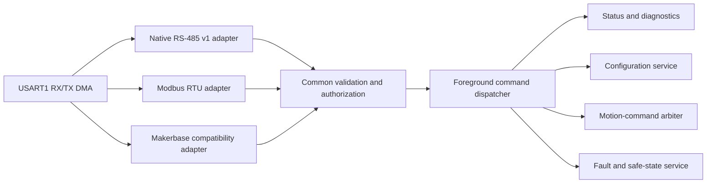

# Command Protocol Architecture

Status: the native v1 base frame, discovery service, and current-loop
commissioning console are implemented and host-tested. The discovery slice is
bench-proven; commissioning commands await a board test. Address provisioning,
duplicate request handling, production control leases, Modbus RTU, and
Makerbase compatibility remain future work.

## Decision

The firmware will expose one transport-independent command service. Native
RS-485, Modbus RTU, and Makerbase-compatible wire decoders are adapters around
that service; none owns motor behavior or bypasses common validation.



The internal command model uses named operations and typed values. Makerbase
function numbers, Modbus register addresses, and native message identifiers
exist only in adapter mapping tables. This keeps command behavior consistent
and host-testable across every interface.

## Protocol roles

### Native RS-485 v1

The native protocol is the canonical interface for new host software and
future features. Version 1 uses a bounded, delimiter-based binary frame:

```text
COBS {
    version:u8 | device_address:u8 | sequence:u16 |
    message_type:u8 | command:u16 | payload_length:u8 |
    payload:0..64 bytes | crc16:u16
} 00
```

All multi-byte values are big-endian. CRC-16/CCITT-FALSE covers the decoded
frame from `version` through the final payload byte: polynomial `0x1021`,
initial value `0xFFFF`, no reflection, and no final XOR. The two-byte CRC is
stored high byte first. The COBS-encoded frame ends with one `0x00` delimiter.
The frame `version` is the protocol major version and is currently `1`;
compatible minor revisions are reported by `GET_IDENTITY`.

The decoded header is 8 bytes, the maximum decoded frame is 74 bytes, and the
maximum on-wire frame including the delimiter is 76 bytes. Frames with an
invalid COBS encoding, inconsistent length, bad CRC, unsupported version, or
excessive encoded length receive no response. After an oversized frame the
parser discards through the next delimiter and starts cleanly.

The `device_address` range is 1-247; firmware currently uses address 1.
Address 0 is broadcast. The initial read-only commands are not broadcast-safe,
so a valid broadcast is counted and dropped without dispatch or response.
Frames for another address and non-request message types are likewise ignored.

Message types are `1` request, `2` response, and `3` event. Requests carry a
16-bit sequence chosen by the host; a response echoes it. Version 1 does not
yet cache or reject duplicate sequences, so the host must wait for a response
or timeout before sending another request to a device.

Every response payload begins with one status byte:

| Value | Status |
| ---: | --- |
| 0 | Success |
| 1 | Unknown command |
| 2 | Invalid payload |
| 3 | Service unavailable |
| 4 | Internal error |

Only complete, version-1, CRC-valid requests for this address receive command
errors. This prevents noise, foreign traffic, broadcasts, responses, or events
from causing reply storms.

### Implemented native commands

| Command | Name | Request payload | Successful response after status |
| ---: | --- | --- | --- |
| `0x0001` | `PING` | 0-16 opaque bytes | The same bytes |
| `0x0002` | `GET_IDENTITY` | Empty | Product ID `u32`, firmware major `u8`, minor `u8`, patch `u16`, protocol major `u8`, minor `u8` |
| `0x0003` | `GET_CAPABILITIES` | Empty | Capability bitmap `u32` |
| `0x0100` | `GET_COMMISSIONING_STATUS` | Empty | Schema-2 commissioning status block |
| `0x0101` | `CONFIGURE_CURRENT_TEST` | Amplitude counts `u16`, frequency millihertz `u32` | Applied amplitude counts `u16`, frequency millihertz `u32` |
| `0x0102` | `START_CURRENT_TEST` | Initial leg `u8`, duration milliseconds `u32` | Empty |
| `0x0103` | `STOP_CURRENT_TEST` | Empty | Empty |
| `0x0104` | `GET_BOOT_STATUS` | Empty | Schema `u8`, RCC reset flags `u32`, retained panic `u8`, uptime milliseconds `u32` |
| `0x0105` | `GET_ENCODER_STATUS` | Empty | Schema `u8`, encoder status `u8`, SPI status `u8`, raw angle `u16`, flags `u8`, sample count `u32`, error count `u32`, last-attempt milliseconds `u32` |

The product ID is `0x4D4B5335` (`MKS5`). The current identity reports firmware
0.17.3 and protocol 1.1. The capability bitmap uses the same stable bit
definitions as the debugger diagnostic record, including the native-protocol
capability.

The commissioning commands are a feasibility-image service, not the
production motion protocol. `CONFIGURE_CURRENT_TEST` is accepted only while
inactive. Amplitude is currently bounded to 1-50 ADC counts and frequency to
1-20000 millihertz. `START_CURRENT_TEST` accepts leg values `0=A1`, `1=A2`,
`2=B1`, and `3=B2`, with a duration from 100 to 60000 ms. It is unavailable
until ADC zero calibration and current-loop initialization complete, or while
authority is already active, a fault is latched, or raw Menu is asserted.
`STOP_CURRENT_TEST` is always accepted and stops either local or remote test
authority. A remote run also stops at its deadline, on raw Menu, or on an
RS-485 transport failure. Foreground parsing continues during a run so status
and STOP remain usable.

`GET_BOOT_STATUS` exposes the complete captured RCC reset-flag mask rather
than only the IWDG summary in commissioning status. This distinguishes RAM,
MMU, pin, power-on, software, independent/window-watchdog, and low-power reset
causes and reports the current boot uptime.

`GET_ENCODER_STATUS` exposes the latest parity-valid 14-bit magnetic angle,
encoder and SPI status, sensor flags, accepted-sample count, error count, and
last-attempt time. The host commissioning console queries it alongside each
current-loop snapshot so rotor displacement can be separated from successful
stator-current commutation.

`GET_COMMISSIONING_STATUS` returns the following schema-2 body after the common
status byte. All multi-byte fields are big-endian; signed fields use two's
complement.

| Body offset | Type | Field |
| ---: | --- | --- |
| 0 | `u8` | Schema version, currently 2 |
| 1 | `u32` | Readiness, authority, pending-action, and fault flags |
| 5 | `u8` | Raw electrical input levels; clear means asserted |
| 6 | `u8` | Debounced electrical input levels; clear means asserted |
| 7 | `u8` | `adc1_status_t` |
| 8 | `u8` | Selected initial leg |
| 9 | `u32` | Current-loop fault flags |
| 13 | `u32` | Completed current-loop sample count |
| 17 | `u16,u16` | Latest current A/B raw ADC values |
| 21 | `u16,u16` | Calibrated current A/B zero values |
| 25 | `i16,i16` | Current A/B references in ADC counts |
| 29 | `i16,i16` | Current A/B measurements in ADC counts |
| 33 | `i16,i16` | Phase A/B controller commands in permille |
| 37 | `u16[4]` | A1, A2, B1, B2 duties in permille |
| 45 | `u16` | Configured test amplitude in ADC counts |
| 47 | `u16` | Maximum configurable test amplitude |
| 49 | `u16` | Raw hard-current limit in ADC counts |
| 51 | `u16` | Phase-voltage limit in permille |
| 53 | `u32` | Configured test frequency in millihertz |
| 57 | `u32` | Remaining remote-run time in milliseconds |
| 61 | `u8` | Panic code retained across the last watchdog reset |
| 62 | `u8` | One if the current boot followed an IWDG reset |

Commissioning flag bits are: bit 0 ADC ready, 1 ADC snapshot valid, 2 zero
calibration ready, 3 current loop initialized, 4 bridge ready, 5 authority
active, 6 ISR backend active, 7 remote authority, 8 remote start pending,
9 remote stop pending, and 10 fault present. The status body is 63 bytes and
the complete successful response payload is 64 bytes.

| Bit | Capability |
| ---: | --- |
| 0 | Bring-up/characterization image |
| 1 | Status LED |
| 2 | Foreground-supervised IWDG |
| 3 | Reset-cause capture |
| 4 | Configured NVIC priority policy |
| 5 | Encoder SPI acquisition |
| 6 | RS-485 RX/TX DMA transport |
| 7 | Native v1 protocol |
| 8 | SSD1306-compatible I2C display |
| 9 | Raw ADC acquisition, including timer-synchronous current capture |
| 10 | Debounced passive-input monitor |
| 11 | Manually gated TIM3 bridge-PWM characterizer |

Golden request vectors below use device address 1, sequence 1, and empty
payloads. Each row is a complete on-wire frame including the final delimiter:

| Command | Hex bytes |
| --- | --- |
| `PING` | `03 01 01 03 01 01 02 01 03 21 58 00` |
| `GET_IDENTITY` | `03 01 01 03 01 01 02 02 03 74 0B 00` |
| `GET_CAPABILITIES` | `03 01 01 03 01 01 02 03 03 47 3A 00` |

The base frame preserves these required properties:

- reliable resynchronization after noise, truncation, or an RX ring overrun;
- explicit protocol version, payload length, and request sequence;
- distinct request, response, and asynchronous-event message types;
- bounded fixed-size parsing with no dynamic allocation;
- device address `0` reserved for broadcasts that never receive replies;
- capability discovery so hosts do not infer features from firmware versions;
- command acceptance reported separately from later motion completion; and
- no dependence on C structure layout or the debugger diagnostic ABI.

### Modbus RTU

Modbus RTU is an optional standards-oriented integration profile for PLCs,
automation software, and generic service tools. It maps registers and command
mailboxes to the same internal service used by the native protocol.

The project-owned register map should use standard function and exception
behavior, clearly separate read-only status from writable configuration, and
provide coherent blocks where practical. The sparse Makerbase D-series map may
be offered as compatibility aliases, but it is not the canonical internal data
model.

Modbus framing requires an explicit receive-silence policy. USART IDLE is a
boundary hint; the foreground framer owns the required timing and CRC checks.

### Makerbase compatibility

The publicly documented Makerbase `FA`/`FB` RS-485 protocol is an optional
legacy profile for existing controllers and host tools. Compatibility applies
only to commands deliberately listed and tested by this project. It does not
authorize reproducing undocumented firmware or bootloader behavior.

The first compatibility subset should be read-only and low risk: identity,
version, encoder/status queries, application state, and faults. Configuration,
homing, enable, speed, position, synchronization, and calibration aliases are
added only when the corresponding internal service and safety contract exist.
Firmware-upgrade and bulk-write commands remain separate deferred decisions.

Native extensions must not be added to the Makerbase frame namespace. That
format has command-dependent implicit lengths, an 8-bit additive checksum, and
response behavior that is awkward to version and resynchronize.

Protocol mode is selected explicitly through safe configuration or a local
interface. The firmware will not guess among native, Modbus, and legacy modes
from arbitrary received bytes.

## Common behavioral and safety contract

All adapters are untrusted-input boundaries and follow the same rules:

- DMA moves bytes only. Framing, CRC, address checks, validation, dispatch, and
  reply creation execute as bounded foreground work.
- Malformed, unsupported, out-of-range, or unauthorized commands have no motor
  effect and never refresh a remote-control lease.
- A remote motion lease is refreshed only by a newly accepted command from its
  current owner or an explicit newly accepted `KEEPALIVE`. An exact retry is
  idempotent and does not refresh the lease. Lease expiry requests a bounded
  trajectory stop and disables control after the stopped trajectory and
  measured motion satisfy their completion tolerances.
- Configuration that affects control or safety is immutable while running and
  changes only through a validated safe-state transaction.
- Broadcast commands never produce replies. Broadcast motion is accepted only
  for operations explicitly declared broadcast-safe.
- Multidrop RS-485 telemetry is polled or granted a transmission slot. Devices
  do not emit arbitrary periodic traffic that can collide with another slave.
- A staged-motion plus broadcast-commit operation may provide multi-axis
  synchronization, but stale, duplicated, incomplete, or mismatched stages are
  rejected deterministically.
- Protocol commands request behavior; they never manipulate bridge GPIO,
  timer, ADC, or DMA registers directly.

### Implemented transport-independent motion contract

The portable application layer now implements the semantics below the wire
adapters:

- native, Modbus, Makerbase, step/direction, and local inputs share one motion
  authority; only its owner may change position targets;
- valid stop and disable requests remain available regardless of the current
  owner or the source's permission to initiate motion;
- the eight most recently accepted `(source, command_id)` identities are
  retained: an exact replay is a duplicate with no repeated effect, while the
  same identity with different content is a conflict;
- command acceptance is distinct from active and terminal completion, and
  status retains the two most recent terminal outcomes with source identity;
- a new explicit heartbeat supports moves longer than one lease interval; and
- step/direction is represented as timestamped cumulative hardware counts,
  with re-anchoring at enable and bounded count-rate validation.

These are application contracts, not new native-v1 wire commands. Command IDs,
payload encoding, status/event messages, permission configuration, and each
protocol adapter still need explicit mappings. The modules compile for the Arm
target but remain excluded from the passive bring-up image.

## Implementation sequence

1. **Complete:** define host-testable command request, response, error,
   capability, and dispatcher types with no wire-format dependency.
2. **In progress:** the COBS/CRC native v1 framer, discovery commands, and
   current-loop commissioning console are implemented. General application,
   encoder, and production motion status plus broader fuzz coverage remain.
3. Add the Modbus RTU adapter and project-owned register map to the same
   read-only services, followed by safe configuration transactions.
4. Add the documented Makerbase read-only compatibility subset and byte-level
   conformance tests from public manual examples.
5. **Application prerequisite complete:** the portable application shell,
   limits, command arbiter, retry history, lease, safe-stop, and completion
   behavior exist and have end-to-end simulated-plant tests. Add native motion
   wire mappings only after the hardware control state has a proven disable
   path; homing remains deferred until alignment behavior exists.
6. Add telemetry scheduling, staged synchronization, compatibility matrices,
   final lease timing, and hardware-in-the-loop multidrop tests.

Every parser needs tests for valid frames, every truncated length, excessive
lengths, bad CRCs, noise before and between frames, unknown commands, invalid
addresses, broadcast reply suppression, duplicate sequences, RX overruns, and
TX-busy handling.

## Evidence from published manuals

The protocol split is based on these cached, hash-verified public documents:

- `servo57d-rs485-manual-v1.0.9`: custom framing and checksum on page 26;
  command and response behavior on pages 27-100.
- `servo57d-modbus-manual-v1.0.9`: Modbus communication constraints and
  supported functions on page 9; documented register operations on pages
  10-65.
- `servo57d-can-manual-v1.0.9`: CAN framing on page 25 and the corresponding
  command vocabulary on pages 26-98.

The manuals show that the custom RS-485 and CAN products reuse command meanings
through different transport wrappers, while the RS-485 product can select a
separate Modbus RTU mode. That makes a common semantic service with wire
adapters a natural clean-sheet boundary.

## Open specification decisions

Before native v1 grows beyond the read-only discovery slice, decide and record:

- address range, provisioning, and recovery behavior after a lost address;
- native motion command identifiers, data units, scaling, and mappings from
  wire sequences to application command identities;
- motion status/event payloads for acceptance, active state, and retained
  terminal results;
- the production lease duration and how it is provisioned;
- the project-owned Modbus register map and supported function codes; and
- the exact Makerbase compatibility matrix, baud options, and response modes.
