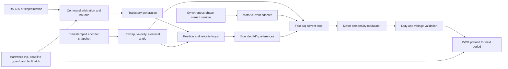

# Real-Time and Control Architecture

Status: this document defines the intended execution model and ownership boundaries. It does not authorize bridge operation. Interrupt sources, loop rates, PWM alignment, ADC trigger placement, comparator shutdown, and numerical representation remain subject to the corresponding hardware gates in `PLAN.md`.

## Goals

- Make bridge shutdown independent of ordinary application scheduling.
- Give the current-control path deterministic timing and bounded execution.
- Keep communications, display, configuration, and diagnostics out of hard-real-time interrupts.
- Share control math between a two-phase stepper personality and a three-phase sensored PMSM/BLDC personality without sharing unsafe hardware abstractions.
- Detect missed samples and control deadlines rather than silently using stale outputs.
- Keep pure control, estimation, bounds, and message-handling logic host-testable.

## Execution model

The initial motor-control implementation will remain bare-metal:

- Interrupts own hardware event capture, immediate fault response, and the fast current-control deadline.
- A cooperative foreground loop owns state transitions, complete-frame parsing, configuration, diagnostics, and other non-real-time work.
- Hardware peripherals schedule PWM edges and ADC conversions. Software delay loops must never define control timing.
- An RTOS may be reconsidered only after measured scheduling requirements justify its additional memory, timing, and fault surface.

There is one normal writer for each real-time data object. The safety subsystem is the intentional exception: it may preempt any owner to force a terminal disabled state, after which ordinary writers are prohibited from re-enabling outputs.

## NVIC policy

The Nations device header defines four implemented NVIC priority bits, providing 16 programmable priority levels. The passive foundation initializes and reads back PRIGROUP value `3`: four preemption bits and no subpriority bits. A lower numerical value has higher urgency. Compile-time assertions preserve the priority ordering below, and timebase initialization verifies SysTick at priority 15 before returning success.

Subpriorities are deliberately avoided. They change ordering between simultaneously pending interrupts without allowing preemption, which obscures the timing model without helping the fast loop.

### Priority classes

The numeric assignments below reserve gaps for sources discovered during bring-up. They do not enable any peripheral by themselves.

| Priority | Class | Candidate sources | Required behavior |
| ---: | --- | --- | --- |
| 0 | Emergency fault | Comparator trip, RAM parity, power-stage fault | Hardware should already be safe where possible; force the common bridge-off primitive, latch the source, and never return to `RUN` |
| 1 | Control deadline guardian | Selected PWM-period/update event | Detect an incomplete preceding fast loop or missing sample and disable immediately; do no control math |
| 2 | Fast current control | ADC sequence complete or its DMA completion | Validate the new sample, execute the bounded current loop, and stage the next PWM preload values |
| 4 | Rotor feedback capture | Encoder SPI/DMA completion | Validate and publish a timestamped angle snapshot; never run position or current control here |
| 6 | Motion-command capture | Step-counter overflow or input-capture maintenance | Extend hardware counts and publish input state; do not interpret a complete motion command |
| 8 | Communications transfer | USART and communications DMA | Move bytes, acknowledge errors, and publish buffer ownership only |
| 12 | Optional slow-loop release | Dedicated scheduler timer, if measurements justify it | Set a due flag or run a strictly bounded slow-control step |
| 15 | Timekeeping/deferred work | SysTick and optional PendSV | Maintain coarse time and release lowest-priority foreground work |

NMI and fault exceptions retain their architectural priorities. Core faults and unexpected interrupts continue to converge on the project panic path. Once a bridge backend exists, that path must invoke the same idempotent bridge-off primitive before recording diagnostics and halting.

If fault and normal-completion flags share an IRQ, the handler checks the fault flags first. For example, an ADC analog-watchdog condition must be handled before an end-of-conversion condition in the shared ADC vector.

## Interrupt-handler contract

Every ISR must meet these rules:

- No polling for another peripheral, blocking wait, dynamic allocation, recursive call, Flash write, logging, display update, or complete protocol parse.
- No unbounded loop. Any retry count is fixed and demonstrably shorter than the interrupt's budget.
- Snapshot the relevant status and data, acknowledge only understood flags, and publish the smallest possible result.
- Use fixed-size data and statically allocated storage.
- Do not call code that can acquire a lock held by foreground or a lower-priority interrupt.
- Do not attempt to “catch up” by executing multiple missed control iterations. A missed deadline is a latched fault.
- Measure worst-case execution using the Cortex-M DWT cycle counter once the final clock is enabled.
- Maintain per-source counts for invocation, error, overrun, and maximum observed duration.

`PRIMASK` is reserved for reset, panic, and the final bridge-off sequence. Ordinary critical sections use `BASEPRI` so priority-zero fault handling remains available. Critical sections must cover only a few bounded loads/stores; they are not a substitute for clear data ownership.

## Shared-data ownership

| Object | Normal writer | Readers | Publication method |
| --- | --- | --- | --- |
| Raw current sample and timestamp | ADC/DMA completion ISR | Fast current loop | ISR-local values or a sequence-numbered sample slot |
| Encoder angle/status/timestamp | Foreground bring-up reader; future encoder completion ISR | Diagnostics now; fast and slow loops later | Sequence-numbered snapshot; readers retry if publication changes |
| Motion command | Foreground command arbiter | Trajectory/slow loop | Validated double buffer swapped at a slow-loop boundary |
| `Id`/`Iq` references | Slow control loop | Fast current loop | Bounded double buffer swapped at a fast-loop boundary |
| Current-controller state | Fast current loop | Diagnostics only | Single writer; diagnostics receive a copied snapshot |
| PWM preload request | Fast current loop | PWM backend | Single writer during `RUN`; safety may override only by disabling |
| Fault state | Safety subsystem | All layers | Monotonic atomic latch or per-source slots; never cleared from an ISR |
| Configuration | Foreground configuration service | Control initialization | Immutable while running; changes require a safe-state transaction |
| Debugger diagnostic record | Foreground diagnostics service | Debugger and future telemetry service | Versioned sequence-numbered snapshot; readers accept matching even sequences |
| RS-485 RX circular bytes | DMA channel 4 | Foreground transport consumer | Monotonic produced/consumed counts; cursor laps discard and account the oldest bytes |
| RS-485 TX staging frame | Foreground transport API | DMA channel 5, then USART1 shifter | Fixed buffer is immutable while busy; USART TXC releases PA8 and ownership |

Volatile qualification alone is not a synchronization mechanism. Multiword structures use a sequence counter or buffer handoff, and monotonic fault bits use an actually atomic operation or separate writer-owned slots.

## DMA and hardware-offload policy

The N32L406 provides one DMA controller with eight independently configured
logical channels. Each channel selects one of the peripheral request sources and
supports byte, half-word, or word transfers, four software priority levels,
circular operation, and transfer-complete, half-transfer, and error events. The
controller can move data between memory and peripherals without instruction
execution, but it is not a control coprocessor: transforms, estimation, limits,
PI control, validation, and state transitions remain CPU work.

DMA and the Cortex-M4F share the AHB fabric. They may access different slaves in
parallel, but access to the same SRAM or peripheral is arbitrated. The expected
motor-control traffic is small enough that bandwidth should not be limiting;
the architectural benefit is bounded latency and freedom from polling or
per-byte interrupts. DMA is therefore assigned by deterministic value rather
than used automatically for every transferable object.

### Provisional `RUN` channel budget

The request selector makes the physical channel choice flexible. Lower channel
numbers win ties between equal programmed priorities, so the final assignment
should place the synchronous sample path first:

| Provisional channel | Request/role | DMA priority | Policy |
| ---: | --- | --- | --- |
| 1 | ADC current-sample capture | Very high | Circular capture of one complete A/B sample set; interrupt only when the accepted set is complete |
| 2 | Encoder SPI receive | High | Publish one timestamped frame at completion; never wait for SPI in the current ISR |
| 3 | Encoder SPI transmit/start | High | Reserve only if measurements show that DMA is preferable to one bounded CPU write |
| 4 | USART1 receive | Medium | Move bytes into a bounded circular or block buffer; parse only in foreground |
| 5 | USART1 transmit | Medium | Transmit a validated frame; RS-485 direction changes only after USART transmission-complete, not merely DMA completion |
| 6 | Optional TIM3 burst update | High | Reserved for measurement; not used by the initial PWM backend |
| 7-8 | Spare or safe-state-only service | Low | No new `RUN` consumer without a channel-budget and latency review |

The table is a capacity and priority plan, not authorization to enable a
peripheral. SPI1 is the documented encoder instance; its future DMA request
mapping and every final channel assignment remain bench-verification items.

### Use by subsystem

- **Synchronous ADC:** prefer a continuously configured circular transfer that
  publishes only a complete, ordered current-sample set. The N32L40x errata
  warns that disabling and re-enabling ADC DMA can transfer a retained old ADC
  value first. Any design that rearms the channel must implement and test the
  documented extra-sample workaround. A missing, duplicate, late, clipped, or
  transfer-error sample is a fast-loop fault rather than permission to reuse an
  earlier duty request.
- **Encoder SPI:** DMA is valuable when it removes a busy wait and publishes a
  precisely completed transaction. Because an encoder frame is small, DMA
  setup can cost more cycles than a bounded register operation; foreground
  polling is used for initial bring-up, and DMA is adopted only after both paths
  are measured.
- **USART1/RS-485:** RX and TX DMA eliminate per-byte interrupt work. DMA owns
  byte movement only; framing, CRC, address checks, command validation, timeout
  policy, and PA8 direction turnaround remain explicit software behavior.
- **TIM3 PWM:** the timer can accept a DMA burst into consecutive compare
  registers, but the initial backend writes four validated preload registers
  directly. Four stores are inexpensive, make buffer ownership obvious, and
  avoid an autonomous circular transfer replaying stale active duties. A DMA
  burst may replace them only if cycle and safety measurements show a material
  benefit and the deadline guardian can prove that no stale set becomes active.
- **I2C1/display:** do not use I2C DMA in `RUN`. N32L40x Errata Sheet V2.1.0
  states that I2C communication can become abnormal when another peripheral is
  using the single DMA controller; its workaround disables other DMA traffic.
  Display traffic remains bounded polling or interrupt work in foreground and
  may be deferred while the bridge is active.
- **Memory copies:** do not use memory-to-memory DMA for small control or
  publication objects. Ownership handoff is preferable to copying, and DMA
  setup plus SRAM contention can exceed the cost of a few CPU loads and stores.

DMA transfer errors are handled according to the channel's safety role. A
current-sample or future PWM-transfer error invokes the common bridge-off path.
A communications or display error invalidates that transaction and is reported
without retrying in an unbounded ISR. No ISR silently clears, rearms, and
continues a safety-critical channel after an unexplained transfer error.

## Time domains

Rates are initial hypotheses, not requirements.

| Domain | Candidate rate | Trigger/owner | Output |
| --- | ---: | --- | --- |
| PWM carrier | Approximately 20 kHz | Hardware timer | Bridge waveform and internal sampling events |
| Fast current loop | Once per selected current sample | ADC sequence completion | Validated voltage/duty request for the next update |
| Encoder acquisition | Approximately 5–10 kHz | Timer-released SPI/DMA transaction | Timestamped mechanical-angle snapshot |
| Position/velocity control | Approximately 1 kHz | Foreground or bounded scheduler release | Bounded `Id`/`Iq` request |
| Trajectory generation | 100 Hz–1 kHz | Foreground | Bounded position and velocity references |
| Communications | Event-driven | USART/DMA plus foreground parser | Validated commands and telemetry requests |
| Housekeeping | 10–100 Hz | Foreground | Diagnostics, thermal state, and noncritical status |

The selected rates must be derived from measured ADC settling, current-loop plant response, encoder transaction time and noise, CPU budget, and switching losses. The current non-control MT6816 reader runs at 100 Hz; it does not claim the candidate 5-10 kHz rotor-feedback timing.

## Processor and cycle budget

Motor-control timing is budgeted in core cycles, not average foreground load.
The current bridge-safe image remains at 4 MHz; the examples below apply only after
64 MHz clock operation has passed its hardware gate:

| Candidate event rate | Core cycles between events at 64 MHz |
| ---: | ---: |
| 20 kHz | 3,200 |
| 40 kHz | 1,600 |
| 10 kHz | 6,400 |
| 1 kHz | 64,000 |

For an initial 20 kHz, one-sample-per-carrier design, an engineering target of
approximately 1,000-1,200 worst-case cycles for the complete fast ISR would
consume about 31-38% of the core and preserve preemption and foreground margin.
This is a planning target rather than a release limit. The actual acceptance
limit is set from DWT measurements of the selected numerical implementation,
all validation branches, interrupt entry/exit, DMA completion handling, and
the longest permitted higher-priority nesting. A 40 kHz or dual-sample design
is not accepted merely because its average execution time fits within 1,600
cycles.

Cycle-conservation rules for the hard-real-time path are:

- Let timers generate PWM edges, ADC triggers, step counts, and scheduling
  events; do not reproduce peripheral timing in software.
- Generate one interrupt for a complete useful transaction or sample set, not
  for every byte or ADC rank.
- Do not call general-purpose transcendental, formatting, allocation, protocol,
  or Flash-service routines from the fast ISR.
- Keep constant lookup tables in Flash. Compare measured Cortex-M4F
  single-precision and explicitly saturated fixed-point implementations before
  selecting the fast-loop numerical policy.
- Prefer hardware CRC, timer input capture, comparator shutdown, and USART/SPI
  shift engines where their documented behavior satisfies the safety contract.
- Record maximum observed cycles per ISR and fault on a missed control epoch;
  never average away a worst-case deadline violation.

## Control data flow

Communications and step/direction are command sources. Neither is permitted to write a timer compare register, controller integrator, or bridge-enable state directly.

## Common current-control core

The intended common control domain is stationary `alpha/beta` current transformed into rotor-relative `d/q` current:

| Stage | Two-phase bipolar stepper | Three-phase sensored PMSM/BLDC |
| --- | --- | --- |
| Current observation | A/B winding currents map to orthogonal `alpha/beta` after measured sign/scale correction | Two measured phase currents reconstruct the third; a Clarke transform produces `alpha/beta` |
| Electrical angle | Mechanical encoder angle mapped through measured stepper geometry and alignment | Mechanical encoder angle multiplied by measured pole-pair count and corrected by alignment |
| Current regulation | Common Park transform and bounded `d/q` PI controllers | Common Park transform and bounded `d/q` PI controllers |
| Voltage command | Common inverse Park transform to stationary voltage | Common inverse Park transform to stationary voltage |
| Modulation | Two bipolar H-bridges | Three-leg modulation/SVPWM with the unused fourth leg held in its proven disabled state |

The motor personality owns current/angle adaptation and modulation. It does not own PWM registers, ADC timing, fault latching, or bridge enable. A four-phase personality is not assumed feasible until current observability and the exact motor connection are established.

### Fast-loop sequence

For each accepted sample period, the fast loop performs one bounded pass:

1. Verify the expected sample sequence and control epoch.
2. Check ADC status, clipping, plausibility, and independent hard-current limits.
3. Apply calibrated offsets, gains, signs, and motor-specific current adaptation.
4. Extrapolate electrical angle from the latest valid encoder snapshot within a bounded age limit.
5. Transform measured current to `d/q`.
6. Apply bounded `Id` and `Iq` references and execute anti-windup PI controllers.
7. Inverse-transform the bounded voltage request.
8. Run the selected modulator.
9. Validate every duty against independent minimum, maximum, and topology constraints.
10. Write only preload registers and mark the control epoch complete.

Any invalid sample, stale encoder, nonfinite value, arithmetic overflow, late completion, or invalid duty invokes the common bridge-off path instead of reusing the previous active command.

### Outer loops

The slower control path is cascaded:

1. A trajectory generator applies position, velocity, and acceleration limits.
2. The position controller produces a bounded velocity request.
3. The velocity controller produces a bounded torque-producing current request.
4. Motor-specific policy selects the `Id` reference; the initial permanent-magnet default is zero unless commissioning proves otherwise.
5. The fast loop independently clamps both current references.

Following error, velocity, acceleration, current, voltage request, and duty cycle each retain independent limits. Saturation at one layer does not disable checks in another layer.

## PWM and ADC scheduling

The published schematic and the Delsian CAN-board project provide strong evidence that PA6, PA7, PB0, and PB1 can operate as TIM3 channels 1–4. This remains provisional until the purchased RS-485 board and alternate-function behavior are verified.

N32L40x User Manual V2.6 documents the relevant internal triggers:

- A regular ADC sequence can be triggered by `TIM3_TRGO`.
- An injected ADC sequence can be triggered by `TIM3_CC4`.
- TIM3 can select its update event or an `OCxREF` signal as TRGO.
- In center-aligned mode, update events can occur at both counter overflow and underflow.

Because TIM3 channel 4 is also needed for PB1 bridge control, `TIM3_CC4` would place ADC timing at a duty-dependent bridge compare event. A center-aligned `TIM3 update -> TRGO` configuration can produce two triggers per complete carrier cycle. Neither path may be assumed to provide one fixed quiet sample per PWM period.

Candidate timing strategies are therefore:

1. Begin with edge-aligned TIM3 PWM and one unambiguous update/sample opportunity per carrier period.
2. Synchronize an otherwise pinless auxiliary timer to the PWM timebase and use its fixed compare/TRGO event to trigger the ADC.
3. Intentionally sample both halves of a center-aligned cycle and design the control rate, publication, and symmetry checks around both samples.

Selection requires register-level timing review followed by oscilloscope measurements of PWM edges, amplifier settling, ADC trigger position, and interrupt latency. The timing backend must expose the same “sample accepted / preload next command” contract regardless of which strategy wins.

## Deadline supervision

If the chosen timing design provides one explicit control-period boundary, a higher-priority guardian may supervise the fast loop:

1. At the period boundary, verify that the preceding control epoch completed.
2. If not, invoke the bridge-off path and latch a control-overrun fault.
3. Arm the expected sample sequence for the new period.
4. The ADC completion ISR consumes that sequence, runs one fast step, stages preload values, and marks completion.

The guardian is optional only if an equivalent hardware/peripheral mechanism proves missed samples and late computations cannot preserve an unsafe active command.

## Watchdog supervision

The independent watchdog is a slower, final recovery layer; it does not replace the priority-1 control-deadline guardian or `bridge_emergency_off()`. Its reload key is private to one foreground-owned supervisor. SysTick, peripheral ISRs, and the fast current loop have no feed API, so one surviving interrupt cannot hide a stalled foreground or failed execution domain.

The bridge-safe image requests service every 100 ms with a nominal 1,000 ms IWDG timeout. A foreground polling gap above 250 ms, an application state other than diagnostics, or an incomplete/failed [boot self-test](BOOT_SELF_TEST.md) permanently refuses further service and enters the panic path. A stopped timebase also prevents scheduled service. These are initial bring-up values rather than final motor-control deadlines; see [Independent watchdog policy](WATCHDOG.md).

Before `RUN` exists, the supervisor's health input must aggregate explicit progress evidence from every safety-critical execution owner, including the completed control epoch supervised by the higher-priority deadline guardian. Watchdog reset is too slow to be a safe response to an active bridge fault, missed current sample, invalid duty request, or stale encoder.

The current bridge-safe image pauses IWDG when the debugger halts the core because no bridge output can be enabled. That debug exemption is prohibited in a bridge-capable image; debugger halt must then produce and preserve the proven hardware-safe output state.

## Fault and shutdown architecture

`bridge_emergency_off()` will be the single project-owned immediate shutdown primitive once the power-stage truth table is proven. It must be:

- Idempotent and safe from any exception or interrupt context.
- Independent of clocks or services that a fault may have corrupted.
- A short, bounded sequence of direct register operations.
- Able to prevent staged PWM values from becoming active later.
- Followed by a latched state that forbids re-enable without an explicit safe-state recovery sequence.

Software priority is secondary to hardware shutdown. The N32L40x timer/comparator routing documents a promising candidate: COMP1 and COMP2 outputs can be routed to TIM3 `OCREF-clear`, and the general timer channels can clear `OCxREF` when the selected comparator/ETRF condition is active. This could suppress PWM without ISR latency. Whether the two bipolar current channels can obtain complete positive and negative overcurrent coverage, and whether all four outputs reach a safe EG3013 input state, must be demonstrated on the bench.

Debugger halt, watchdog reset, clock failure, malformed communications, stale encoder data, control overrun, and invalid configuration must all converge on the same disabled outcome. Breakpoints while the bridge is active remain prohibited until debugger-freeze behavior and shutdown are explicitly verified.

## Numerical policy

The passive firmware currently uses the soft floating-point ABI. Floating-point control code must not enter the fast ISR under that configuration.

Before integrating the current loop, compare:

- Cortex-M4F single-precision code built with an explicit FPU/ABI configuration.
- A fixed-point implementation with defined saturation and overflow behavior.

Whichever implementation is selected must pass the same host vectors, saturation tests, invalid-input tests, and replay traces. Higher-priority fault and deadline handlers must not use the FPU. Fast-math transformations that weaken NaN, infinity, or ordering behavior are not enabled without a separate review.

## Verification strategy

Before bridge operation, the architecture should have:

- Host tests for transforms, angle wrapping, PI anti-windup, modulation bounds, trajectory limits, stale-data handling, and configuration validation.
- A deterministic software plant/replay harness for stepper and three-phase current-loop test vectors.
- Tests that inject missing samples, duplicate sequences, stale encoder snapshots, nonfinite values, saturation, and deadline overruns.
- Compile-time checks for the NVIC grouping and assigned priority range.
- On-target cycle instrumentation and stack high-water measurements.
- Oscilloscope validation of ADC trigger position, PWM preload timing, emergency shutdown latency, reset, watchdog, and debugger halt.

## Open hardware-dependent decisions

| Decision | Evidence needed |
| --- | --- |
| Edge- versus center-aligned PWM | EG3013 behavior, switching waveform, current ripple, and timer/ADC timing measurements |
| One versus two current samples per carrier | Amplifier settling, ADC timing, CPU budget, and control stability |
| TIM3-only versus synchronized auxiliary timer | Internal trigger mapping verified on silicon and scoped trigger timing |
| Exact PWM and loop rates | Measured plant, switching losses, noise, and worst-case execution time |
| Comparator-based hardware trip | Comparator routing, thresholds, bipolar-current coverage, and resulting gate-driver state |
| Floating-point versus fixed-point fast loop | On-target numerical equivalence and worst-case cycle measurements |
| Encoder acquisition rate and prediction horizon | Fitted sensor identity, SPI timing, noise, and latency |
| Step/direction capture peripheral | Physical pin alternate functions and maximum required input rate |

Until these decisions are closed, project-owned control code may implement and test pure algorithms and interfaces, but it must not configure the bridge pins or expose an enable operation.
