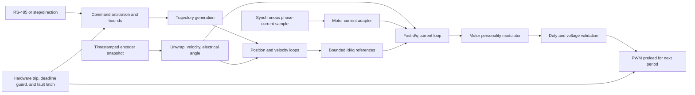

# Real-Time and Control Architecture

Status: firmware 0.34.0 implements the fast current path, production
alignment, safe-state configuration maintenance, the first aligned torque-current
motion client, and a deterministic 4 kHz timer/SPI-DMA/PendSV rotor service.
Edge-aligned
20 kHz PWM, TIM2-relative 80%-carrier ADC start, DMA-completion fixed-point
current control, and the carrier deadline guardian remain the project-owned
backend. Firmware 0.24.14 removes the local fixed-duty characterization path;
all retained motor operations use the supervisor and current backend. Firmware
0.24.15 makes the rotor runtime the sole estimator owner and defines the
immutable observation boundary used by slower loops. Firmware 0.25.1 runs the
first bounded velocity PI once per accepted rotor observation and maps its
mechanical effort through the persisted alignment direction before routing it
through the existing aligned-q-current actuator. Firmware 0.26.0 adds focused
relative position on the same accepted-sample release, and firmware
0.26.1 adds an independent foreground encoder-production deadline. This
document defines those boundaries and the route to faster outer loops. Firmware
0.27.1 turns each accepted encoder phase/velocity observation into a bounded
predictor seed and regenerates aligned-q A/B references on every 20 kHz current
event.
Firmware 0.28.0 also follows each regular current pair with an automatic-
injected PA3 VBUS conversion. Regular DMA completion and current-loop release
remain first; foreground alone consumes the later VBUS result.
Firmware 0.29.0 keeps fault acknowledgment in foreground: it establishes
direct-GPIO `ZERO` before rebuilding ADC/DMA, TIM3/current-loop, rotor-runtime,
and supervisor state. No ISR clears its own latch.
Firmware 0.29.1 separates the controllers' 2 ms timestamp-interval check from
the predictor's 3 ms observation/dispatch horizon and reports retained
prediction-age rejection evidence.
Firmware 0.29.2 makes the shared microsecond clock coherent when a higher-
priority caller preempts the low-priority SysTick handler during epoch service.
Firmware 0.29.3 makes the independent observed-acceleration shutdown traceable
to twice the fastest inner reference slew and codifies the shared position,
velocity, and torque deadline ordering.
Firmware 0.31.0 adds an inactive-only current-gain rebuild: foreground
establishes `ZERO`, validates a complete candidate, resets controller state,
and publishes it before any later authority can start. Active fast control
remains immutable. The current source candidate releases the four-byte MT6816
exchange every 250 us at an 8 MHz SPI clock with the established chip-select
guards retained, optimizes the complete deferred estimator/control chain at
`-O2` even in Debug, and uses the Cortex-M4F single-precision hardware through
the `softfp` ABI. These outer-path changes do not alter the fixed-point 20 kHz
current path and remain pending hardware timing and numerical acceptance.
Firmware 0.32.2 treats that active backend-owned configuration as already
validated in the fast step, leaves timing instrumentation dormant until an
explicit trace arm, publishes compact rotor progress at 4 kHz and full
controller state at 100 Hz or on transitions, and schedules foreground safety
housekeeping at 1 ms. Immediate ISR/runtime fault shutdown is unchanged.

## Goals

- Make bridge shutdown independent of ordinary application scheduling.
- Give the current-control path deterministic timing and bounded execution.
- Keep communications, display, configuration, and diagnostics out of hard-real-time interrupts.
- Share control math between a two-phase stepper personality and a three-phase sensored PMSM/BLDC personality without sharing unsafe hardware abstractions.
- Detect missed samples and control deadlines rather than silently using stale outputs.
- Keep pure control, estimation, bounds, and message-handling logic host-testable.

## Execution model

The motor-control implementation remains bare-metal:

- Interrupts own hardware event capture, immediate fault response, and the fast current-control deadline.
- A cooperative foreground loop owns state transitions, complete-frame parsing, configuration, diagnostics, and other non-real-time work.
- Hardware peripherals schedule PWM edges and ADC conversions. Software delay loops must never define control timing.
- An RTOS may be reconsidered only after measured scheduling requirements justify its additional memory, timing, and fault surface.

There is one normal writer for each real-time data object. The safety subsystem is the intentional exception: it may preempt any owner to force the characterized terminal bridge state, after which ordinary writers are prohibited from changing outputs.

## NVIC policy

The Nations device header defines four implemented NVIC priority bits, providing 16 programmable priority levels. The passive foundation initializes and reads back PRIGROUP value `3`: four preemption bits and no subpriority bits. A lower numerical value has higher urgency. Compile-time assertions preserve the priority ordering below, and timebase initialization verifies SysTick at priority 15 before returning success. `timebase_micros()` reconciles the hardware fraction and software epoch through a bounded exclusive-access publication, so current control retains priority without observing the one-tick handler-service gap as backward time.

Subpriorities are deliberately avoided. They change ordering between simultaneously pending interrupts without allowing preemption, which obscures the timing model without helping the fast loop.

### Priority classes

The numeric assignments below reserve gaps for sources discovered during bring-up. They do not enable any peripheral by themselves.

| Priority | Class | Candidate sources | Required behavior |
| ---: | --- | --- | --- |
| 0 | Emergency fault | Comparator trip, RAM parity, power-stage fault | Hardware should already be bounded where possible; force the common bridge-fault primitive, latch the source, and never return to `RUN` |
| 1 | Control deadline guardian | Selected PWM-period/update event | Detect an incomplete preceding fast loop or missing sample and disable immediately; do no control math |
| 2 | Fast current control | ADC sequence complete or its DMA completion | Validate the new sample, execute the bounded current loop, and stage the next PWM preload values |
| 4 | Rotor feedback capture | Encoder SPI/DMA completion | Validate and publish a timestamped angle snapshot; never run position or current control here |
| 6 | Motion-command capture | Step-counter overflow or input-capture maintenance | Extend hardware counts and publish input state; do not interpret a complete motion command |
| 8 | Communications transfer | USART and communications DMA | Move bytes, acknowledge errors, and publish buffer ownership only |
| 12 | Deferred rotor control | PendSV from SPI completion | Decode the completed frame, update the estimator/controller, and publish snapshots/mailbox commands |
| 15 | Timekeeping | SysTick | Maintain coarse time and foreground liveness accounting |

NMI and fault exceptions retain their architectural priorities. Core faults and unexpected interrupts continue to converge on the project panic path. The active bridge backend invokes the same idempotent all-low fault primitive before recording diagnostics and halting.

If fault and normal-completion flags share an IRQ, the handler checks the fault flags first. For example, an ADC analog-watchdog condition must be handled before an end-of-conversion condition in the shared ADC vector.

## Interrupt-handler contract

Every ISR must meet these rules:

- No polling for another peripheral, blocking wait, dynamic allocation, recursive call, Flash write, logging, display update, or complete protocol parse.
- No unbounded loop. Any retry count is fixed and demonstrably shorter than the interrupt's budget.
- Snapshot the relevant status and data, acknowledge only understood flags, and publish the smallest possible result.
- Use fixed-size data and statically allocated storage.
- Do not call code that can acquire a lock held by foreground or a lower-priority interrupt.
- Do not attempt to “catch up” by executing multiple missed control iterations. A missed deadline is a latched fault.
- Measure worst-case execution using the Cortex-M DWT cycle counter once the final clock is enabled.
- Maintain per-source counts for invocation, error, overrun, and maximum observed duration.

Firmware 0.30.0 implements the first bounded fast-path measurement channel.
The 256-entry one-shot trace can be armed from foreground during active
motion. In firmware 0.32.2 its timing reads are dormant before that explicit
arm and after the buffer fills, authority stops, or a fault occurs. TIM2,
clocked continuously at 32 MHz, then records ADC trigger phase and
trigger-to-DMA-entry latency. The 64 MHz DWT counter records end-to-end
DMA-entry-to-PWM-stage and DMA-entry-to-trace-preparation cycles, including any
higher-priority guardian preemption, while TIM3
records preload margin to the next update. Prediction age/phase and the current
reference/measurement/output are stored in the same sample. No encoding,
transport, allocation, or waiting occurs in either interrupt; the trace is read
only after authority ends. The armed interval is 256 samples/12.8 ms and the
fixed buffer occupies 8,192 bytes of SRAM1.

Firmware 0.34.0 also makes the retained rotating-current diagnostic a native
fast-loop reference source. Its phase accumulator and divide-free ramp DDA
advance once per accepted 20 kHz ADC/current event before the prevalidated PI
step; foreground retains only command validation, authority, ramp-plus-hold
deadline, STOP, and telemetry ownership. Static A/B references, encoder-aligned
q references, and the diagnostic oscillator are mutually exclusive backend
modes. The priority-1 PWM guardian retains its fault-on-two-consecutive-misses
policy and now publishes each run's total missing-output boundaries and maximum
consecutive count through the inactive snapshot/status path.

`PRIMASK` is reserved for reset, panic, and the final bridge-fault sequence. Ordinary critical sections use `BASEPRI` so priority-zero fault handling remains available. Critical sections must cover only a few bounded loads/stores; they are not a substitute for clear data ownership.

## Shared-data ownership

| Object | Normal writer | Readers | Publication method |
| --- | --- | --- | --- |
| Raw current sample and timestamp | ADC/DMA completion ISR | Fast current loop | ISR-local values or a sequence-numbered sample slot |
| Raw VBUS sample | ADC automatic-injected completion | Foreground telemetry | Latest completed injected register plus validity and an accepted-sample count; never a current-loop prerequisite |
| Encoder progress | TIM6 captures time at CS assertion; PendSV-deferred rotor runtime publishes after SPI DMA/hold | Foreground liveness, readiness, and state invariants | A sequence-protected 56-byte record publishes at 4 kHz with encoder production, coherent estimator position/velocity/timestamp/health, active-control flags, and full-snapshot generation |
| Full rotor/controller status | PendSV-deferred rotor runtime | Commands, telemetry, and diagnostics | A sequence-protected 576-byte snapshot publishes at 100 Hz and on requests, faults, events, clears, and initialization; foreground consumes it at 100 Hz or when progress reports a new generation |
| Motion command | Foreground command arbiter | Trajectory/slow loop | Validated double buffer swapped at a slow-loop boundary |
| Current references | Slow control loop or fast diagnostic oscillator | Fast current loop | Bounded aligned-q/static publication, or backend-owned 20 kHz oscillator state selected only while inactive |
| Current-controller state | Fast current loop | Diagnostics only | Single writer; diagnostics receive a copied snapshot |
| PWM preload request | Fast current loop | PWM backend | Single writer during `RUN`; safety may override only by disabling |
| Fault state | Safety subsystem | All layers | Monotonic atomic latch or per-source slots; never cleared from an ISR |
| Configuration | Foreground configuration service | Control initialization | Compiled-default, stored, and volatile-active snapshots; immutable while running, with whole-candidate safe-state publication |
| Debugger diagnostic record | Foreground diagnostics service | Debugger and future telemetry service | Versioned sequence-numbered snapshot; readers accept matching even sequences |
| RS-485 RX circular bytes | DMA channel 4 | Foreground transport consumer | Monotonic produced/consumed counts; cursor laps discard and account the oldest bytes |
| Microsecond timestamp | SysTick plus any interrupt/foreground caller | Encoder, current backend, liveness, and control | Four-attempt raw snapshot plus four-attempt exclusive monotonic publication; one sub-period epoch regression is reconciled and larger stale samples clamp |
| RS-485 TX staging frame | Foreground transport API | DMA channel 5, then USART1 shifter | Fixed buffer is immutable while busy; USART TXC releases PC13 and ownership |

Volatile qualification alone is not a synchronization mechanism. Multiword structures use a sequence counter or buffer handoff, and monotonic fault bits use an actually atomic operation or separate writer-owned slots.

## DMA and hardware-offload policy

The N32L406 provides one DMA controller with eight independently configured
logical channels. Each channel selects one of the peripheral request sources and
supports byte, half-word, or word transfers, four software priority levels,
circular operation, and transfer-complete, half-transfer, and error events. The
controller can move data between memory and peripherals without instruction
execution, but it is not a control coprocessor: transforms, estimation, limits,
PI control, validation, and state transitions remain CPU work.

DMA and the Cortex-M4F share the AHB fabric. They may access different slaves in
parallel, but access to the same SRAM or peripheral is arbitrated. The expected
motor-control traffic is small enough that bandwidth should not be limiting;
the architectural benefit is bounded latency and freedom from polling or
per-byte interrupts. DMA is therefore assigned by deterministic value rather
than used automatically for every transferable object.

### Provisional `RUN` channel budget

The request selector makes the physical channel choice flexible. Lower channel
numbers win ties between equal programmed priorities, so the final assignment
should place the synchronous sample path first:

| Provisional channel | Request/role | DMA priority | Policy |
| ---: | --- | --- | --- |
| 1 | ADC current-sample capture | Very high | Circular capture of one complete A/B sample set; interrupt only when the accepted set is complete |
| 2 | Encoder SPI receive | High | Active; completion closes the transaction and releases deferred rotor work |
| 3 | Encoder SPI transmit | Low | Active; supplies the fixed request while RX owns completion |
| 4 | USART1 receive | Medium | Move bytes into a bounded circular or block buffer; parse only in foreground |
| 5 | USART1 transmit | Medium | Transmit a validated frame; RS-485 direction changes only after USART transmission-complete, not merely DMA completion |
| 6 | Optional TIM3 burst update | High | Reserved for measurement; not used by the initial PWM backend |
| 7-8 | Spare or safe-state-only service | Low | No new `RUN` consumer without a channel-budget and latency review |

The table is a capacity and priority plan, not authorization to enable a
peripheral. SPI1 DMA channel assignments are bench-verified; any new consumer
still requires a channel-budget and latency review.

### Use by subsystem

- **Synchronous ADC:** prefer a continuously configured circular transfer that
  publishes only a complete, ordered current-sample set. The N32L40x errata
  warns that disabling and re-enabling ADC DMA can transfer a retained old ADC
  value first. Any design that rearms the channel must implement and test the
  documented extra-sample workaround. A missing, duplicate, late, clipped, or
  transfer-error sample is a fast-loop fault rather than permission to reuse an
  earlier duty request.
- **Injected VBUS:** one slow PA3 conversion automatically follows the regular
  pair. It has no DMA/ISR and is read by foreground. At 16 MHz the regular pair
  takes about 2.5 microseconds and VBUS takes about 4.25 microseconds, leaving a
  nominal 3.25 microseconds before the next carrier trigger. Hardware must
  confirm both voltage plausibility and unchanged current-loop deadline margin.
- **Encoder SPI:** TIM6 releases a 4 kHz transaction every 250 us and captures
  its timestamp when CS is asserted. TIM7 enforces
  the retained CS setup and hold guards, and DMA channels 2/3 move the fixed
  four-byte frame at an 8 MHz SPI clock. The 2 us setup, 4 us wire transfer, and
  2 us hold mean this acquisition-start timestamp is about 8 us earlier than
  post-hold publication; the sensor's exact internal latch instant remains a
  hardware detail. PendSV performs decode/runtime work. One post-power-up
  exchange is explicitly primed and discarded; subsequent errors are reported
  normally.
- **USART1/RS-485:** RX and TX DMA eliminate per-byte interrupt work. DMA owns
  byte movement only; framing, CRC, address checks, command validation, timeout
  policy, and PC13 direction turnaround remain explicit software behavior.
- **TIM3 PWM:** the timer can accept a DMA burst into consecutive compare
  registers, but the initial backend writes four validated preload registers
  directly. Four stores are inexpensive, make buffer ownership obvious, and
  avoid an autonomous circular transfer replaying stale active duties. A DMA
  burst may replace them only if cycle and safety measurements show a material
  benefit and the deadline guardian can prove that no stale set becomes active.
- **I2C1/display:** do not use I2C DMA in `RUN`. N32L40x Errata Sheet V2.1.0
  states that I2C communication can become abnormal when another peripheral is
  using the single DMA controller; its workaround disables other DMA traffic.
  Display traffic remains bounded polling or interrupt work in foreground and
  may be deferred while the bridge is active.
- **Memory copies:** do not use memory-to-memory DMA for small control or
  publication objects. Ownership handoff is preferable to copying, and DMA
  setup plus SRAM contention can exceed the cost of a few CPU loads and stores.

DMA transfer errors are handled according to the channel's safety role. A
current-sample or future PWM-transfer error invokes the common bridge-fault path.
A communications or display error invalidates that transaction and is reported
without retrying in an unbounded ISR. No ISR silently clears, rearms, and
continues a safety-critical channel after an unexplained transfer error.

## Time domains

The current backend rates are measured operating choices; outer-loop rates are
initial targets.

| Domain | Candidate rate | Trigger/owner | Output |
| --- | ---: | --- | --- |
| PWM carrier | 20 kHz | TIM3 hardware timer | Bridge waveform and internal sampling events |
| Fast current loop | 20 kHz | ADC DMA sequence completion | Validated voltage/duty request for the next update |
| Encoder acquisition | 4 kHz | TIM6/TIM7 plus 8 MHz SPI1 DMA channels 2/3 | CS-assertion-timestamped mechanical-angle snapshot and interval telemetry |
| Aligned q-current demand/seed | 4 kHz | PendSV-deferred accepted encoder sample | Slew-limited q-current plus timestamped phase/velocity observation |
| Electrical-phase advance and A/B mapping | 20 kHz | ADC DMA completion | Phase predicted to the measured PWM application boundary and fresh A/B current references |
| Velocity control | 4 kHz | PendSV-deferred accepted encoder sample | Acceleration-limited reference and bounded q-current target for the aligned actuator |
| Position control | 4 kHz | PendSV-deferred accepted encoder sample | Bounded dynamic velocity target |
| Trajectory generation | 4 kHz | Same accepted-sample position update | Bounded position and velocity references |
| Communications | Event-driven | USART/DMA plus foreground parser | Validated commands and telemetry requests |
| Safety housekeeping | 1 kHz | Foreground | Compact rotor progress, liveness/readiness, runtime events, state invariants, RS-485 health, diagnostic deadline, and watchdog policy |
| Full rotor telemetry | 100 Hz plus transitions | PendSV publication plus foreground | Controller/estimator status without a 576-byte copy on every rotor release or foreground wake |
| Noncritical housekeeping | 5–100 Hz | Foreground | Display, diagnostics, thermal state, and noncritical status |

The active 20 kHz rate has completed roughly 160,000 recent fault-free loop
samples. Firmware 0.24.13 introduced encoder acquisition at 1 kHz, timestamped
each accepted sample in microseconds, and reported the latest and maximum
observed interval. The corresponding deterministic hardware regression held
the latest/worst interval to 1000/1001 us with zero errors, and a 606 mA
five-second aligned-torque run completed 100,000 current-loop updates with zero
encoder, estimator, DMA, backend, or control faults. Firmware 0.25.1 originally
added software-floating-point PI and reference-slew work to that PendSV release,
and firmware 0.26.0 added position/profile work and passed mirrored
±0.25-revolution moves with captured 1000 us encoder intervals.

The current source candidate replaces that operating point with a 4 kHz,
250 us release and an 8 MHz four-byte SPI transaction while retaining the
timer-owned chip-select guards and DMA/PendSV ownership. The complete deferred
transport, decode, estimation, alignment, torque, velocity, position, PI, and
profile chain is optimized at `-O2` in Debug, and its floating-point outer
control uses the hardware single-precision FPU through the `softfp` ABI. The
4 kHz estimator uses a `0.03283179` velocity-filter alpha, and position requires
200 settled observations to retain the existing 50 ms settle duration. The
legacy 1 kHz results do not validate this candidate: worst-case PendSV duration,
20 kHz current-ISR preemption, SPI/sample integrity, stack high-water use, and
numerical equivalence remain hardware acceptance gates.

The 0.32.2 hot path skips repeated scans of the backend-owned configuration
after start or reconfiguration has validated and frozen it. It still checks
ADC range, independent hard current, references, control state, generated
duties, PWM register state/readback, and the priority-1 output-generation
deadline on every applicable pass. Disarmed operation also skips TIM2
trigger/entry reads, DWT timing reads, and preload-margin acquisition; an
explicit trace arm restores the complete timing record transaction-coherently.

The user's initial 4 kHz observation is informal bench evidence only. Without a
captured timing/fault record it does not qualify the new release rate, SPI
integrity, deferred-chain WCET, preemption margin, estimator noise, or numerical
behavior.

## Processor and cycle budget

Motor-control timing is budgeted in core cycles, not average foreground load.
Firmware 0.20.0 uses the bench-proven 64 MHz clock tree and a 20 kHz fast
current path. The table gives the available cycle intervals; worst-case ISR
instrumentation remains release work:

| Candidate event rate | Core cycles between events at 64 MHz |
| ---: | ---: |
| 20 kHz | 3,200 |
| 40 kHz | 1,600 |
| 10 kHz | 6,400 |
| 4 kHz | 16,000 |

For an initial 20 kHz, one-sample-per-carrier design, an engineering target of
approximately 1,000-1,200 worst-case cycles for the complete fast ISR would
consume about 31-38% of the core and preserve preemption and foreground margin.
This is a planning target rather than a release limit. The actual acceptance
limit is set from DWT measurements of the selected numerical implementation,
all validation branches, interrupt entry/exit, DMA completion handling, and
the longest permitted higher-priority nesting. A 40 kHz or dual-sample design
is not accepted merely because its average execution time fits within 1,600
cycles.

The 4 kHz rotor release has 16,000 core cycles between nominal events. Its
acceptance budget includes the complete DMA-to-PendSV deferred chain plus any
higher-priority 20 kHz current-loop preemption; enabling hardware
single-precision and `-O2` does not substitute for measuring that worst case.

Cycle-conservation rules for the hard-real-time path are:

- Let timers generate PWM edges, ADC triggers, step counts, and scheduling
  events; do not reproduce peripheral timing in software.
- Generate one interrupt for a complete useful transaction or sample set, not
  for every byte or ADC rank.
- Do not call general-purpose transcendental, formatting, allocation, protocol,
  or Flash-service routines from the fast ISR.
- Keep constant lookup tables in Flash. The active phase loop uses explicitly
  saturated fixed-point arithmetic; floating point remains available to slower
  layers after measured timing review.
- Prefer hardware CRC, timer input capture, comparator shutdown, and USART/SPI
  shift engines where their documented behavior satisfies the safety contract.
- Record maximum observed cycles per ISR and fault on a missed control epoch;
  never average away a worst-case deadline violation.

## Control data flow

Communications and step/direction are command sources. Neither is permitted to write a timer compare register, controller integrator, or bridge-enable state directly.

## Common current-control core

The intended common control domain is stationary `alpha/beta` current transformed into rotor-relative `d/q` current:

| Stage | Two-phase bipolar stepper | Three-phase sensored PMSM/BLDC |
| --- | --- | --- |
| Current observation | A/B winding currents map to orthogonal `alpha/beta` after measured sign/scale correction | Two measured phase currents reconstruct the third; a Clarke transform produces `alpha/beta` |
| Electrical angle | Mechanical encoder angle mapped through measured stepper geometry and alignment | Mechanical encoder angle multiplied by measured pole-pair count and corrected by alignment |
| Current regulation | Common Park transform and bounded `d/q` PI controllers | Common Park transform and bounded `d/q` PI controllers |
| Voltage command | Common inverse Park transform to stationary voltage | Common inverse Park transform to stationary voltage |
| Modulation | Two bipolar H-bridges | Three-leg modulation/SVPWM with any unused leg held in a topology-specific characterized state |

### Portable implementation status

The hardware-independent portion is implemented under `firmware/src/control/`
and `firmware/src/app/`. Product modules are linked into `mks57d`. The
standalone step/direction decoder and d/q voltage controller are compiled as
the explicitly non-product `mks57d_future_control` target and in host tests.
The authoritative drive supervisor, mechanical angle tracker, measured
stepper-alignment geometry, signed q-current actuator, focused bounded velocity
and relative-position controllers, and independent encoder-liveness guard use
the proven phase-current backend:

- `rotor_control_runtime` alone unwraps raw encoder angle in both directions
  with timestamp, sample-age, maximum-velocity, and filter contracts, then
  publishes an immutable valid/timestamp/position/velocity observation;
- a trapezoidal position trajectory independently limits reference velocity
  and acceleration;
- the product velocity controller consumes only that observation, acceleration-
  limits its reference, applies PI anti-windup at the per-command current limit,
  and updates only the bounded aligned-q-current actuator;
- the focused product position controller advances a trapezoidal trajectory on
  the same accepted observation and supplies only a bounded dynamic target to
  the velocity controller;
- step/direction consumes cumulative hardware-count snapshots, re-anchors on
  enable, and rejects ambiguous or implausible count changes without requiring
  an interrupt for each edge; it is not yet connected to product motion;
- Park/inverse-Park transforms and two anti-windup PI axes emit a
  magnitude-limited stationary voltage request for later PMSM or common-current
  work; and
- deterministic mechanical and two-axis RL plant tests cover the active
  controller layers and the retained future-control primitives.

The active stepper path does not send the portable d/q controller's voltage
output to PWM. At each accepted 4 kHz encoder sample it validates phase,
velocity, acceleration, backend state, and deadline, slews signed q-current,
and publishes a timestamped measured-phase/filtered-velocity seed. On each
20 kHz DMA completion the backend extrapolates phase to the measured PWM
application boundary, adds 90 degrees, and regenerates A/B current references
before the already-qualified A/B PI step. The predictor is fixed-point, includes
a measured 55 us output lead, permits at most 3,000 us of observation age, and
immediately forces `ZERO` on invalid or stale prediction. Four nominal encoder
periods, 1 ms total, of PendSV dispatch margin separate that horizon from the
controllers'
2 ms timestamp-interval check; the predictor may never outlive the independent
3 ms encoder-production guard. The
0.25 velocity loop commands
that production actuator with its own target, acceleration, current, feedback-
age, speed, numeric, and deadline checks. Direct d/q voltage integration remains
separate active work requiring its own modulation and timing evidence. The 0.26 position
layer adds independent travel, start-speed, following-error, settling, and
deadline checks above the same velocity/current contracts.

When explicitly armed, the timing burst measures the implemented seams without
changing them. The
TIM2 count just before the ADC software trigger identifies trigger delivery
relative to the carrier. TIM2 elapsed ticks to DMA entry include conversion and
interrupt-entry latency. DWT cycles to the verified TIM3 compare preload bound
the control work, the later trace-preparation stamp captures the recorder cost,
and remaining TIM3 ticks state the actual next-update margin. DWT is not used
across `WFI`, because its count is not the wall-time authority while the core
clock may sleep.

The first +8 rev/s burst on firmware 0.30.0 measured a 41.094 us trigger and
3.938 us trigger-to-DMA interval. DMA entry to staged compares took
20.578-21.141 us, crossing the 50 us update; the reported 33.031-33.594 us
margin is therefore to the 100 us boundary at which those compares become
active. Firmware 0.30.1 predicts 55 us from DMA completion to that application
boundary. It retains the 80%-carrier acquisition window and the guardian's one
intentional intervening update.

These tests establish signs, units, bounds, state ownership, and fault
behavior. They do not establish loop gains, numerical representation,
electrical-angle alignment, current scaling, modulation, or stability on the
physical motor.

The motor personality owns current/angle adaptation and modulation. It does not own PWM registers, ADC timing, fault latching, or bridge enable. A four-phase personality is not assumed feasible until current observability and the exact motor connection are established.

### Fast-loop sequence

For each accepted sample period, the fast loop performs one bounded pass:

1. Verify the expected sample sequence and control epoch.
2. Check ADC status, clipping, plausibility, and independent hard-current limits.
3. Apply calibrated offsets, gains, signs, and motor-specific current adaptation.
4. Extrapolate electrical angle from the latest valid encoder snapshot within a bounded age limit.
5. Transform measured current to `d/q`.
6. Apply bounded `Id` and `Iq` references and execute anti-windup PI controllers.
7. Inverse-transform the bounded voltage request.
8. Run the selected modulator.
9. Validate every duty against independent minimum, maximum, and topology constraints.
10. Write only preload registers and mark the control epoch complete.

Any invalid sample, stale encoder, nonfinite value, arithmetic overflow, late completion, or invalid duty invokes the common bridge-fault path instead of reusing the previous active command.

### Outer loops

The slower control path is cascaded:

1. A trajectory generator applies position, velocity, and acceleration limits.
2. The position controller produces a bounded velocity request.
3. The velocity controller produces a bounded torque-producing current request.
4. Motor-specific policy selects the `Id` reference; the initial permanent-magnet default is zero unless commissioning proves otherwise.
5. The fast loop independently clamps both current references.

Following error, velocity, acceleration, current, voltage request, and duty cycle each retain independent limits. Saturation at one layer does not disable checks in another layer.
Position, velocity, and aligned-torque layers start from the same timestamp and
finite duration. Position is evaluated first and owns ordinary deadline release;
an earlier inner-layer completion is a cascade-contract fault.

## PWM and ADC scheduling

The Nations 2.3.0 four-channel PWM example maps PA6, PA7, PB0, and PB1 to
TIM3 channels 1-4 on AF2, matching the published schematic and the Delsian
CAN-board project. Firmware 0.20.0 uses that edge-aligned 20 kHz mapping and
stages low-zero sign-magnitude current-loop duties. All four outputs, phase
polarities, current quadrants, and attached-motor operation are proven on the
purchased RS-485 board.

N32L40x User Manual V2.6 documents the relevant internal triggers:

- A regular ADC sequence can be triggered by `TIM3_TRGO`.
- An injected ADC sequence can be triggered by `TIM3_CC4`.
- TIM3 can select its update event or an `OCxREF` signal as TRGO.
- In center-aligned mode, update events can occur at both counter overflow and underflow.

Because TIM3 channel 4 is also needed for PB1 bridge control, `TIM3_CC4` would place ADC timing at a duty-dependent bridge compare event. A center-aligned `TIM3 update -> TRGO` configuration can produce two triggers per complete carrier cycle. Neither path may be assumed to provide one fixed quiet sample per PWM period.

Timing strategies are therefore:

1. **Active current-loop path:** edge-aligned TIM3 PWM with TIM2 reset
   from update. TIM2 compare at 80% invokes a bounded ISR that software-starts
   the two-rank `currentB`/`currentA` regular sequence. This bypasses the
   unproven internal TIM2_CC2-to-ADC route while preserving timer-relative
   sampling.
2. The direct TIM3-update trigger remains a bench-proven passive
   acquisition fallback; it is not a quiet switched-current sampling point.
3. Intentionally sample both halves of a center-aligned cycle and design the control rate, publication, and symmetry checks around both samples.

The first strategy is selected and operating. Oscilloscope measurements of PWM
edges, amplifier settling, trigger position, and interrupt latency will quantify
its margin as the current and speed envelope expands. Any later timing backend
keeps the same “sample accepted / preload next command” contract.

## Deadline supervision

If the chosen timing design provides one explicit control-period boundary, a higher-priority guardian may supervise the fast loop:

1. At the period boundary, verify that the preceding control epoch completed.
2. If not, invoke the bridge-fault path and latch a control-overrun fault.
3. Arm the expected sample sequence for the new period.
4. The ADC completion ISR consumes that sequence, runs one fast step, stages preload values, and marks completion.

The guardian is optional only if an equivalent hardware/peripheral mechanism proves missed samples and late computations cannot preserve an unsafe active command.

## Watchdog supervision

The independent watchdog is a slower, final recovery layer; it does not replace the priority-1 control-deadline guardian or the immediate bridge fault primitive. Its reload key is private to one foreground-owned supervisor. SysTick, peripheral ISRs, and the fast current loop have no feed API, so one surviving interrupt cannot hide a stalled foreground or failed execution domain.

Firmware 0.20.0 requests service every 100 ms with a nominal 1,000 ms IWDG
timeout. A foreground polling gap above 250 ms, an invalid application state,
or an incomplete/failed [boot self-test](BOOT_SELF_TEST.md) refuses further
service and enters the panic path. A stopped timebase also prevents scheduled
service; see [Independent watchdog policy](WATCHDOG.md).

During `RUN`, the control deadline guardian and accepted sample epochs provide
fast-domain progress evidence. Firmware 0.26.1 also compares the foreground
progress snapshot's accepted encoder count/timestamp with a 3 ms wrap-safe
deadline. Firmware 0.32.2 evaluates that threshold on a 1 ms foreground cadence,
so expiry is observed on the next poll. It
stays not-live after a stall until genuine sample progress occurs, removes idle
readiness, and forces any energized authority through the shared fault path.
Watchdog reset remains the slower recovery path for a stalled foreground; the
current backend handles an active bridge fault, missed current sample, or
invalid duty immediately.

IWDG is not paused when the debugger halts the core. A sustained halt therefore
causes a reset after approximately one second. The reset-time tied-EG3013
waveform remains an explicit characterization item.

## Fault and shutdown architecture

`board_bridge_force_low_zero()` is the current backend's single project-owned
immediate fault primitive. It commands all four legs low, producing a zero
differential winding-voltage vector while leaving the low-side FETs selected.
It is not an all-FET-off state. The primitive is:

- Idempotent and safe from any exception or interrupt context.
- Independent of clocks or services that a fault may have corrupted.
- A short, bounded sequence of direct register operations.
- Able to prevent staged PWM values from becoming active later.
- Followed by a latched state that forbids re-enable without an explicit safe-state recovery sequence.

Above that immediate primitive, the product drive supervisor is the sole
application authority owner. It distinguishes diagnostic from motion authority,
permits bridge switching only in `ALIGN` or `RUN`, clears authority on every
fault transition, and treats encoder/current-path readiness loss during an
energized state as `FAULT`. Diagnostic current, alignment, aligned q-current,
velocity, and position all use the same readiness prerequisite and terminal
primitive. Motion deadline and STOP release normally, while the controllers'
independent feedback, motion, numeric, actuator, reference, and backend
violations enter `FAULT` and the same all-low primitive.

Normal deadline and STOP release also end in this all-low vector. Because both
ends of each winding are then selected low, a rotating motor is dynamically
braked and may stop sharply. The tied EG3013 inputs expose no software-commanded
all-FET-off state, so the present board has no true passive coast mode. A normal
controlled-deceleration policy is possible, but it is not coasting; faults must
retain immediate all-low braking.

Software priority is secondary to hardware shutdown. The N32L40x timer/comparator routing documents a promising candidate: COMP1 and COMP2 outputs can be routed to TIM3 `OCREF-clear`, and the general timer channels can clear `OCxREF` when the selected comparator/ETRF condition is active. This could suppress PWM without ISR latency. Whether the two bipolar current channels can obtain complete positive and negative overcurrent coverage, and whether all four outputs reach a safe EG3013 input state, must be demonstrated on the bench.

Debugger halt, watchdog reset, clock failure, malformed communications, stale
encoder data, control overrun, and invalid configuration each need a defined
outcome. The running fault paths converge on all-low. Reset and high-impedance
waveforms still need measurement because the board exposes no
software-commanded all-FET-off state. A debugger halt interrupts active control
and should be used only when that interruption is part of the test.

## Numerical policy

The active 20 kHz phase-current loop remains fixed-point, with defined
saturation and overflow behavior, and continues to pass its host vectors. The
current source candidate enables the Cortex-M4F single-precision hardware for
the deferred estimator, trajectory, and outer-control path while retaining the
`softfp` calling convention. Higher-priority current, fault, and deadline
handlers do not use floating point. Hardware acceptance must preserve the
existing saturation, invalid-input, and replay results and must measure
PendSV/current-ISR preemption, lazy FPU context behavior, numerical equivalence,
and stack high-water use before this numerical contract is considered proven.

## Verification strategy

Verification for the active backend and next control layers includes:

- Host tests for transforms, angle wrapping, PI anti-windup, modulation bounds, trajectory limits, stale-data handling, and configuration validation.
- A deterministic software plant/replay harness for stepper and three-phase current-loop test vectors.
- Tests that inject missing samples, a total production stall, duplicate
  sequences, stale encoder snapshots, counter/timer wrap, nonfinite values,
  saturation, and deadline overruns.
- Compile-time checks for the NVIC grouping and assigned priority range.
- On-target cycle instrumentation and stack high-water measurements.
- Oscilloscope validation of ADC trigger position, PWM preload timing, emergency shutdown latency, reset, watchdog, and debugger halt.

## Open hardware-dependent decisions

| Decision | Evidence needed |
| --- | --- |
| Whether center-aligned PWM would improve the existing edge-aligned backend | Switching waveform, current ripple, and timer/ADC timing measurements |
| Whether more than one current sample per carrier is useful | Amplifier settling, ADC timing, CPU budget, and control stability |
| Whether to replace the synchronized TIM2 software-start path | Scoped trigger timing and a demonstrated benefit |
| Expanded PWM and loop-rate envelope | Measured plant, switching losses, noise, and worst-case execution time |
| Comparator-based hardware trip | Comparator routing, thresholds, bipolar-current coverage, and resulting gate-driver state |
| Hardware-FPU outer-control acceptance | On-target numerical equivalence, lazy-context/preemption timing, and stack high-water measurements |
| 4 kHz encoder acquisition and prediction horizon | 8 MHz SPI integrity, CS-assertion timestamp semantics, sample timing/noise, latency, and worst-case deferred execution |
| Step/direction capture peripheral | Physical pin alternate functions and maximum required input rate |

These decisions guide hardening and the broader operating envelope. They do not
block the proven current backend, automatic-alignment bench gate, or subsequent
velocity and position milestones.
